# Agentic Sandbox Studio — Master Documentation Portal

**Status:** CANONICAL
**Last verified:** 2026-09-22

> **Authoritative technical documentation for the multi-agent sandbox substrate: architecture, Svelte 5 studio UI, verification harness, and ratified requirements.**

---

## 1. Executive Summary & System Overview

The **Agentic Sandbox Studio** is a browser-native, high-assurance orchestration platform built with **Svelte 5 Runes**, a transactional **VirtualFS**, sovereign **Agent Runtimes**, deterministic **Inter-Agent Messaging**, and a unified **Multi-Provider LLM Gateway**.

The platform provides a sovereign multi-agent substrate: multiple autonomous LLM agents coordinate, execute tool calls, read/write virtual file systems, exchange mail, schedule alarms, and maintain transactional state. The interface is sandbox-only — `src/App.svelte` renders `SandboxView`; the legacy single-agent Storyteller app has been removed.

```mermaid
graph TD
    subgraph UI_Layer ["Svelte 5 Studio Interface (src/lib/components/sandbox/)"]
        StudioView["SandboxView (Split-Pane Workstation)"]
        Inspector["AgentInspector (Trace, Telemetry, Context)"]
        ChatLog["SandboxChatLog (Keyed Virtual Stream)"]
        FSExp["VirtualFsExplorer (AST JSON & Grep)"]
        BusView["MessagingBusViewer (Audit Trace & Mailbox)"]
        Modals["Agent Modals (Launcher, Settings Catalog, Recycle Bin)"]
    end

    subgraph State_Layer ["Reactive Store & State Engine (src/lib/sandbox/)"]
        Store["SandboxStore ($state container)"]
        Catalog["PresetCatalog (Single Model-Config Writer)"]
        UndoRedo["Undo/Redo State Machine (Ctrl+Z / Ctrl+Y)"]
        RecycleBin["Soft-Kill Recycle Bin Engine"]
        Persistence["SandboxPersistence (LocalStorage, Debounced)"]
    end

    subgraph Core_Substrate ["Sandbox Core Substrate (src/lib/sandbox/)"]
        Runtime["AgentRuntime (Turn Lifecycle & Compaction)"]
        InvocationEngine["InvocationEngine (Multi-Turn Tool Loops)"]
        TriggerQ["TriggerQueue (Non-Blocking Priority Dispatch)"]
        MsgBus["MessagingBus (FIFO Mailboxes & Broadcast)"]
        ToolDisp["ToolDispatcher (35 Canonical Schemas & Sudo Gate)"]
        VFS["VirtualFS (In-Memory Driver, Byte/Line Pagination, USTAR)"]
        Clock["WorldClock (Simulation Time & Monotonic Ticks)"]
    end

    subgraph Provider_Layer ["Sandbox Inference"]
        Inference["Unified Inference Layer (src/lib/sandbox/inference/)"]
        PremAI["Prem AI (Confidential Enclave + WASM Reticle + KEK)"]
        NanoGPT["NanoGPT (OpenAI-Compatible Aggregator)"]
        Runware["Runware SSE (/v1/chat/completions)"]
        DeepSeek["DeepSeek Native (api.deepseek.com)"]
        CustomAPI["Custom OpenAI-Compatible Endpoint"]
    end

    StudioView --> Store
    Store --> Catalog
    Store --> UndoRedo
    Store --> Persistence
    Runtime --> InvocationEngine
    InvocationEngine --> ToolDisp
    InvocationEngine --> TriggerQ
    InvocationEngine --> MsgBus
    InvocationEngine --> VFS
    InvocationEngine --> Clock
    InvocationEngine --> Inference
    Inference --> PremAI
    Inference --> Runware
    Inference --> NanoGPT
    Inference --> DeepSeek
    Inference --> CustomAPI
```



---

## 2. Master Documentation Index

The living technical documentation is organized into 2 domains covering 11 specifications (plus the ratified `requirements/` set, the sandbox durable notes, and the generated module ICDs):

```
docs/
├── README.md                                  # Master Documentation Portal (This Document)
│
├── sandbox_notes.md                           # Sandbox durable notes: intentional quirks & accepted exceptions
│
├── ui/                                        # Studio UI & Svelte 5 Reactive Architecture
│   ├── studio_overview.md                     # Svelte 5 Studio Layout, Runes Integration, Keyboard Shortcuts, Theme Tokens
│   ├── agent_inspector.md                     # AgentInspector Panel, 3-Tab Architecture, Live Telemetry, Draft Sync
│   ├── virtualfs_explorer.md                  # VirtualFS Explorer, Multi-Tenant Workspaces, AST Query, Regex Grep
│   ├── chat_and_message_cards.md              # SandboxChatLog & MessageCard, Streaming Traces, Reasoning Accordions
│   ├── messaging_bus_viewer.md                # MessagingBusViewer, Live Message Trace, Mailbox Inspector, Injections
│   └── modals_and_dialogs.md                  # AgentLauncher, SandboxSettingsModal (preset catalog + vault), RecycleBin, AgentSettingsPanel, SandboxActionInput
│
└── testing/                                   # Verification, QA & Test Harnesses
    ├── testing_strategy.md                    # Multi-Tier Testing Pyramid, Zero-Mock Philosophy, CI/CD Gates
    ├── unit_and_integration.md                # Node Native Runner (95 suites: 49 Unit / 46 Integration), Integration Test Contracts
    ├── e2e_and_visual.md                      # Playwright Browser E2E Specs (8), Responsive Visual Baselines, Test Auditor
    ├── exploratory_qa_plan.md                 # Agent-Driven Exploratory QA via Playwright MCP, Charters, Secret Handling
    └── audit_and_repro.md                     # Audit Repro Mechanics, Test-First Fix Waves, Provider Smoke Pre-flight
```

> The 11 specifications above are the living technical docs (the two indexed domains). Adjacent sources: [`sandbox_notes.md`](sandbox_notes.md) (engine quirks + accepted exceptions), `requirements/` (8 ratified requirement docs), and the generated module ICDs under [`generated/modules/`](generated/modules/) (tag schema: [`modules/README.md`](modules/README.md)).

### Project State

- **Durable agent rules:** [`../AGENTS.md`](../AGENTS.md) — encapsulation boundaries, gates, workflow protocol, documentation duties, and the `INV-1..9` system invariants (§1).
- **Issue tracking:** product/QA defects are tracked in git-bug (`git bug bug`) as local refs; the tracker is local-only and is not part of the published repository.
- **Module contract docs (ICD):** [`modules/README.md`](modules/README.md) — ratified tag schema, validators, and generated-report conventions (reports → [`generated/modules/`](generated/modules/)).
- **Sandbox-only:** the app shell renders the multi-agent sandbox; the legacy single-agent Storyteller path has been removed.

---

## 3. Core Technical Domains

### Domain 1: Svelte 5 Studio UI & Reactive Components

| Document | Focus | Key Highlights |
| :--- | :--- | :--- |
| [`ui/studio_overview.md`](ui/studio_overview.md) | Studio Workstation | Split-pane workstation layout, Svelte 5 runes (`$state`, `$derived`, `$props`, `$effect`), obsidian palette, global keyboard matrix. |
| [`ui/agent_inspector.md`](ui/agent_inspector.md) | Inspector Panel | 3-tab architecture (Trace, Telemetry, Debug Sent Context), live token consumption grid, per-agent draft synchronization, session recovery notice, execution-error banner (Retry / Undo Turn & Edit Prompt / Dismiss). |
| [`ui/virtualfs_explorer.md`](ui/virtualfs_explorer.md) | File Explorer | Multi-tenant workspace partitions (`global` vs `agent-*`), AST JSON query evaluator, workspace regex line grep, drag-and-drop ingestion. |
| [`ui/chat_and_message_cards.md`](ui/chat_and_message_cards.md) | Conversational UI | Keyed virtual message feed (`msg.id`), streaming prose cursor, collapsible `<thought>` deliberation blocks, inline turn editing, canonical in-transcript failure & interrupted notice cards. |
| [`ui/messaging_bus_viewer.md`](ui/messaging_bus_viewer.md) | Bus Audit Trail | Multi-stage message filter, envelope anatomy breakdown, unread counter badges, interactive manual message injection. |
| [`ui/modals_and_dialogs.md`](ui/modals_and_dialogs.md) | Modals & Action Dock | Agent launch & live settings tabs, soft-kill Recycle Bin, catalog-driven Sandbox Settings modal (presets + credential vault), 3-mode action dock. |

---

### Domain 2: Verification, Quality Assurance & Testing

| Document | Focus | Key Highlights |
| :--- | :--- | :--- |
| [`testing/testing_strategy.md`](testing/testing_strategy.md) | QA Philosophy | The Zero-Mock Mandate, real DOM execution, prohibition of synthetic AST parsing, 4-stage CI/CD validation gates. |
| [`testing/unit_and_integration.md`](testing/unit_and_integration.md) | Substrate Tests | 95 Node.js native test suites (49 Unit, 46 Integration), browser-polyfill test environment, runtime/messaging/tool-loop verification. |
| [`testing/e2e_and_visual.md`](testing/e2e_and_visual.md) | Playwright E2E | 8 browser-driven user journey specs, responsive viewport capture baselines (Desktop 1440x900, Tablet 768x1024, Mobile 375x812). |
| [`testing/exploratory_qa_plan.md`](testing/exploratory_qa_plan.md) | Agent-Driven Exploratory QA | Playwright MCP browser harness, sandbox-studio charters, live-key budget, vault seeding, secret-handling rules. |
| [`testing/audit_and_repro.md`](testing/audit_and_repro.md) | Audit Repro Mechanics | Read-only auditors propose failing tests; fixes commit repros test-first (`tests/audit/`), promote them into suites, and run the provider smoke probe before attributing suite failures to code. |

---

## 4. Developer Quick-Start & Operational Commands

### Prerequisites
- **Node.js**: v20.0.0 or higher
- **npm**: v9.0.0 or higher

### Installation & Development
```bash
git clone <repository-url> ai-story
cd ai-story
npm install
npm run dev       # Start Vite development server with HMR
npm run build     # Build production bundle
npm run preview   # Preview production build locally
```

### Verification & Testing Protocols
```bash
# Default static battery: contracts + module contracts + contract types + api-report freshness + arch + lints + typecheck
npm run verify

# Execute master test suite (95 suites: 49 unit + 46 integration)
npm test

# Execute fast unit tests only
npm run test:unit

# Execute integration test suites
npm run test:integration

# Type gates: jsconfig tsc (0 total / 0 in src/lib/sandbox) + strict contracts tsc (0) + svelte-check (≤96 ratchet)
npm run typecheck

# Execute Playwright browser-driven E2E tests (8 specs)
npm run test:e2e

# Responsive visual capture suite
npx playwright test tests/e2e/08-responsive-visual-capture.spec.js
```

---

## 5. Glossary & Subsystem Reference

- **AgentRuntime**: The sovereign execution container for a single LLM agent, managing turn loops, tool invocation dispatches, context compaction, and secondary stream channels.
- **Cognitive Deliberation Block**: Collapsible UI container displaying real-time `<thought>` and `reasoning_content` deltas from thinking models (DeepSeek-R1).
- **Origin Private File System (OPFS)**: W3C standard browser storage API; the ratified target storage driver for `VirtualFS` ([pivot spec](requirements/opfs_filesystem_pivot_and_undo_redo.md)); the current driver is in-memory.
- **POSIX USTAR**: 512-byte block-aligned standard Unix tar archive format used by `VirtualFS` to export and import entire multi-tenant workspaces.
- **Preset Catalog**: The single writer of model configuration; agents bind to a catalog preset by `presetId`, and `sandboxStore.modelConfig` is a read-only projection of the active preset.
- **Recycle Bin**: Soft-kill agent management engine that preserves conversation history, system prompts, and configuration metadata until permanently purged.
- **Terminal Batch Semantics**: Runtime optimization where an agent issues a `batch_precall` or `runtime_closeTurn` tool call alongside closing text, allowing the turn to conclude in 1 API call without re-invoking the LLM.
- **TriggerQueue**: Centralized asynchronous scheduling queue managing non-blocking message arrivals, scheduled timer alarms, and user directives with anti-head-of-line blocking guarantees.
- **WorldClock**: Monotonic virtual time engine translating real-world ticks into narrative simulation seconds, hours, days, and event registry triggers.
