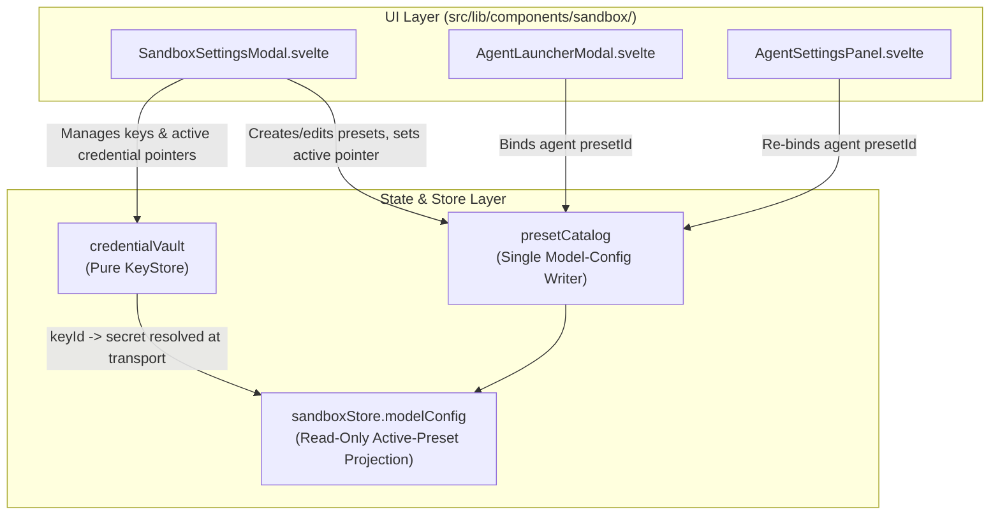

# Settings Credential Isolation & KeyStore Decoupling Specification

**Status:** RATIFIED  
**Last verified: 2026-09-22**  
**Version:** 1.1 (retargeted to the sandbox-only app)  
**Date:** 2026-09-16  
**Scope Owner:** Security Architect & Core Runtime Team  
**Target File:** `docs/requirements/settings_credential_isolation.md`  
**Related Systems:** `src/lib/sandbox/credentialVault/`, `src/lib/sandbox/presetCatalog/`, `src/lib/sandbox/modelConfig/`, `src/lib/sandbox/inference/`, `src/lib/sandbox/sandboxPersistence/`, `src/lib/components/sandbox/SandboxSettingsModal.svelte`, `src/lib/components/sandbox/`

---

## 1. Executive Summary & Objective

Historically, application state and adventure campaign files intertwined model runtime parameters, prompt presets, and sensitive user secrets (such as plaintext API keys and asymmetric encryption keys) inside a shared `gameState.settings` object. This legacy design posed severe security vulnerabilities, data leakage hazards, and architectural coupling:

1. **Snapshot & Export Data Leaks:** Exporting adventure files as JSON (`ai_storyteller_adv_*`) or generating debug state dumps inadvertently bundled live API keys into shareable adventure JSON files, riskily exposing credentials when users shared stories with peers or committed campaign files to version control.
2. **State Pollution & Sync Hazards:** Modifying a game setting (e.g. changing context window size or temperature) risked overwriting or duplicating secret credentials across multi-adventure campaign slots.
3. **Multi-Agent Runtime Confusion:** Sandbox agents attempting to inherit or override model parameters were exposed to legacy credential alias properties (`providerApiKey`, `providerEncryptionKey`, `providerVendor`, `providerUrl`), violating the single source of truth principle.

### Primary Objective

This specification formally codifies the requirements that keep secret credential storage decoupled from model configuration and persisted sandbox state (the historical `gameState.settings` / campaign-JSON coupling was the original defect; those surfaces have been removed) by establishing:

1. **Strict KeyStore Authority:** The `CredentialVault` (`credentialVault`) is the **exclusive, single source of truth** for all sensitive credentials (`keyId -> { id, providerId, label, apiKey, encryptionKey }`).
2. **Pure Model Configuration Contract:** All model configuration in the preset catalog, the `sandboxStore.modelConfig` projection, and agent preset bindings is defined strictly via the universal `AgentModelConfig` contract referencing credentials by immutable ID (`keyId`).
3. **Zero Secret Footprint in Persisted State:** Model presets and the persisted sandbox snapshot (`ai_storyteller_sandbox_state_v1`) contain strictly configuration metadata and key references, guaranteeing zero secret exposure during serialization, export, or logging.
4. **Vault-Managed Credential Lifecycle:** Credential creation, activation, rotation, and deletion happen exclusively through the vault (surfaced by the Sandbox Settings modal); no component writes secrets into model configs or snapshots.

---

## 2. System Architecture & Separation of Concerns

```
+----------------------------------------------------------------------------------------------------+
|                                    CONFIGURATION DOMAIN (Public / State)                           |
|                                                                                                    |
|  presetCatalog preset.modelConfig / agent preset binding / sandboxStore.modelConfig (projection)    |
|  +----------------------------------------------------------------------------------------------+  |
|  | interface AgentModelConfig {                                                                 |  |
|  |   providerId: 'runware' | 'nanogpt' | 'deepseek' | 'prem' | 'custom';                        |  |
|  |   keyId: string;            // Reference ID only (e.g. 'canonical_deepseek', 'cred_xyz789')   |  |
|  |   modelId: string;          // Model identifier (e.g. 'deepseek-flash')                      |  |
|  |   url?: string;             // REQUIRED for 'custom' provider ONLY                           |  |
|  |   temperature?: number;     // 0.0 - 2.0                                                     |  |
|  |   reasoningEffort?: string; // 'none' | 'low' | 'medium' | 'high' | 'max' | 'xhigh'          |  |
|  |   routing?: string;         // NanoGPT routing provider (e.g. 'aoru')                        |  |
|  |   serviceTier?: string;     // NanoGPT service tier (e.g. 'flex')                            |  |
|  | }                                                                                            |  |
|  +----------------------------------------------------------------------------------------------+  |
+-------------------------------------------------+--------------------------------------------------+
                                                  | References `keyId`
                                                  v
+----------------------------------------------------------------------------------------------------+
|                                    SECRET DOMAIN (Isolated KeyStore)                               |
|                                                                                                    |
|  credentialVault (LocalStorage: 'ai_story_credentials_v1' + Memory Fallback)                       |
|  +----------------------------------------------------------------------------------------------+  |
|  | interface CredentialEntry {                                                                  |  |
|  |   id: string;            // 'canonical_runware' | 'canonical_nanogpt' | UUID                     |  |
|  |   providerId: string;    // 'runware' | 'nanogpt' | 'deepseek' | 'prem' | 'custom'           |  |
|  |   label: string;         // 'Runware Primary', 'NanoGPT Flex Account'                        |  |
|  |   apiKey: string;        // Sensitive secret key                                             |  |
|  |   encryptionKey?: string;// Prem symmetric encryption key (if providerId === 'prem')         |  |
|  |   createdAt: number;     // Unix timestamp                                                   |  |
|  |   lastUsed: number|null; // Unix timestamp                                                   |  |
|  |   isCanonical?: boolean; // True for default canonical provider slots                        |  |
|  | }                                                                                            |  |
|  +----------------------------------------------------------------------------------------------+  |
|  * ZERO baseUrls stored in KeyStore (URLs belong to provider internals or AgentModelConfig.url)     |
+-------------------------------------------------+--------------------------------------------------+
                                                  |
                                                  v
+----------------------------------------------------------------------------------------------------+
|                                      TRANSPORT LAYER (Runtime)                                     |
|                                                                                                    |
|  createProvider(modelConfig, credentialVault)                                                      |
|  - Resolves secret apiKey & encryptionKey in memory at transport time.                             |
|  - Injects Authorization headers strictly at HTTP request boundary.                               |
|  - Provider payloads never serialize secrets back into state or logs.                              |
+----------------------------------------------------------------------------------------------------+
```

---

## 3. Architectural Invariants

### 3.1 Pure `AgentModelConfig` Contract
1. **Universal Specification:** Every inference consumer in the codebase—including catalog preset `modelConfig`s (the single writer of global model configuration), the `sandboxStore.modelConfig` projection, and sandbox agent preset bindings (`Agent.config.presetId`)—must strictly adhere to the `AgentModelConfig` interface.
2. **Zero Inlined Credentials:** No `apiKey`, `encryptionKey`, `api_key`, `token`, or credential payloads may exist inside `AgentModelConfig`, catalog presets, or the persisted sandbox snapshot.
3. **Zero Property Aliases:** All legacy alias fields (`providerVendor`, `providerUrl`, `providerApiKey`, `providerEncryptionKey`, `providerApiKeys`, `providerEncryptionKeys`, `providerModels`, `providerUrls`) are completely abolished from model configurations.
4. **KeyStore Reference Integrity:** The `keyId` property is mandatory on every `AgentModelConfig`. When unset, it defaults to the canonical key ID for that provider: `'canonical_' + providerId`.

### 3.2 KeyStore Purity (`credentialVault`)

> **Implementation note (2026-09-17):** The vault now complies with this requirement — it stores secrets only (`apiKey` / `encryptionKey`), drops `baseUrl` entirely, and persists under `ai_story_credentials_v1` in `src/lib/sandbox/credentialVault/index.ts`.

1. **Scope Restriction:** The `CredentialVault` manages strictly cryptographic secrets and authentication tokens mapped by unique `keyId`.
2. **Zero BaseURL Pollution:** The `CredentialVault` MUST NOT store, manage, or return `baseUrl` properties. Base URLs are either hardcoded constants within closed provider adapters (`RunwareProvider`, `NanoGptProvider`, `DeepSeekProvider`, `PremProvider`) or supplied explicitly via `AgentModelConfig.url` for the custom provider (`OpenAIProvider`).
3. **Canonical Slots:** For each supported provider (`runware`, `nanogpt`, `deepseek`, `prem`, `custom`), `credentialVault` maintains a default canonical entry (`canonical_${providerId}`). Users may additionally create custom labeled entries.
4. **Active Credential Pointers:** `credentialVault` maintains an active credential ID pointer per provider (`active: { [providerId]: keyId }`), allowing users to switch active keys globally with zero mutations to story state.

### 3.3 Strict Separation of Concerns
1. **Sandbox State:** The persisted sandbox snapshot (`ai_storyteller_sandbox_state_v1`) is strictly runtime and presentation state — agents/messages, VirtualFS snapshot, schedulers, recycle bin, draft inputs, and the catalog's custom preset entries + active pointer. It contains no credential material. Catalog presets carry only `AgentModelConfig` metadata (provider, model, temperature, reasoning, optional `url`/`routing`) plus identity/display fields.
2. **Storage Separation:**
   - Sandbox State/Presets: Stored under `ai_storyteller_sandbox_state_v1` via `sandboxPersistence`; the `presetCatalog` persists only through the store-owned adapter backed by that snapshot.
   - Credentials Data: Stored under `ai_story_credentials_v1` in browser `localStorage`, written only by `credentialVault`.
   - Resetting the sandbox or editing presets has zero effect on the user's stored API credentials in `credentialVault`.

---

## 4. UI Surface & Credential Lifecycle



### 4.1 Sandbox Settings Modal (`SandboxSettingsModal.svelte`)
* **Model Presets Section (catalog-driven):**
  - Selects, edits, saves, creates custom, and deletes custom presets through the `presetCatalog` module; selecting a preset sets the active pointer.
  - Preset fields: provider, model id, custom endpoint `url` (custom provider only), upstream routing (NanoGPT), temperature, reasoning effort.
* **Credential Vault Section:**
  - Displays all credentials grouped by provider.
  - Supports adding labeled keys, editing labels/key strings, deleting non-canonical entries, and setting the active credential per provider.
  - Secret fields are masked by default with reveal/copy actions and zero plaintext console output.

### 4.2 Credential Onboarding (No Wizard)

The legacy `ApiKeySetup.svelte` wizard was deleted in W5. First-run credential entry happens directly in the Sandbox Settings modal's credential vault section; keys are written only through `credentialVault` (`(keyId, secret)` pairs), never into preset configs or snapshots.

### 4.3 Agent Launch & Edit Surfaces (`AgentLauncherModal.svelte`, `AgentSettingsPanel.svelte`)

* **Binding-only model selection:** agents store `presetId`; the effective `AgentModelConfig` comes from the bound catalog preset at launch/turn start.
* No inline `apiKey`, `encryptionKey`, or `apiUrl` fields exist in agent configuration surfaces. The custom provider `url` is a preset field.
* Credential rotation propagates at the next turn start through the preset resolver.

### 4.4 Legacy Migration (retired)

The legacy state-migration pipeline (`storage.migrateLegacyState()`, `src/lib/utils/storage.js`, and the `gameState` adventure records it migrated) has been removed; there is no legacy credential surface left to migrate. The vault carries its own schema validation and redacted export semantics.

---

## 5. Security & Compliance Guarantees

### 5.1 Snapshot & Export Sanitization
1. **Sandbox Snapshot Sanitization (`sandboxPersistence`):** Persisted sandbox snapshots (`ai_storyteller_sandbox_state_v1`) strip secrets, API keys, encryption keys, and KEKs from agent and model configurations prior to serialization; model-config `url` endpoint references are retained by design.
2. **Vault Exports:** `credentialVault.exportCredentials()` is redacted by default; full-secret copies require explicit opt-in in code and are never exposed by the UI.
3. **Diagnostic Redaction:** Persisted diagnostic errors pass the shared redaction filters (`sandboxPersistence` / `sandboxStore`); logs, errors, and snapshots never contain tokens or keys.

### 5.2 Network & Logging Hygiene
1. **Transport Boundary Isolation:** Credentials from `credentialVault` are injected into HTTP request headers exclusively at the final transport boundary (`RunwareProvider/`, `NanoGptProvider/`, `DeepSeekProvider/`, `PremProvider/`, `OpenAIProvider/` under `src/lib/sandbox/inference/`).
2. **Error Logging & Exception Sanitization:** Network failure logs and API error handlers must never include authorization headers or query parameters containing secret tokens.

---

## 6. Acceptance Criteria

| ID | Criterion | Validation Method |
| :--- | :--- | :--- |
| **AC-SEC-01** | Catalog presets and the persisted sandbox snapshot contain strictly `modelConfig` metadata with zero secret keys. | Inspect `sandboxStore` state and `localStorage['ai_storyteller_sandbox_state_v1']`; confirm absence of `apiKey`, `providerApiKey`, `providerApiKeys`. |
| **AC-SEC-02** | Persisting the sandbox produces state with zero plaintext secrets. | Trigger a debounced save; verify regex `apiKey`, `providerApiKey`, `sk-` matches against the stored snapshot return 0 hits. |
| **AC-SEC-03** | `CredentialVault` manages all credentials with labeled IDs and persists to `ai_story_credentials_v1`. | Add a custom key in the `SandboxSettingsModal` vault section; verify storage under `ai_story_credentials_v1` and zero mutation in the snapshot or presets. |
| **AC-SEC-04** | All provider adapters resolve secrets dynamically via `keyId` from `credentialVault`. | Execute sandbox turns; verify the provider initializes with valid credentials resolved from the vault. |
| **AC-SEC-05** | Legacy credential channels are absent: no code path reads or writes the retired `ai_storyteller_provider_*` / `ai_storyteller_adv_*` keys. | Repo-wide search for the retired keys and the legacy `storage` module returns 0 application hits. |
| **AC-SEC-06** | Custom OpenAI provider requires explicit `url` in `modelConfig` and resolves key from vault without `baseUrl` pollution. | Test custom provider endpoint; verify `url` is loaded strictly from `AgentModelConfig.url` and key from `keyId`. |
