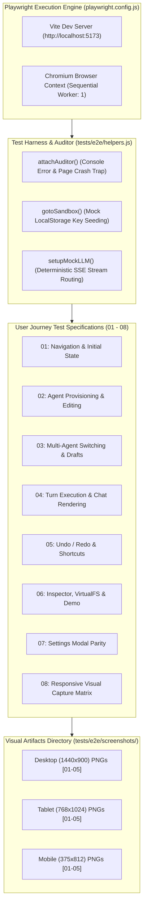
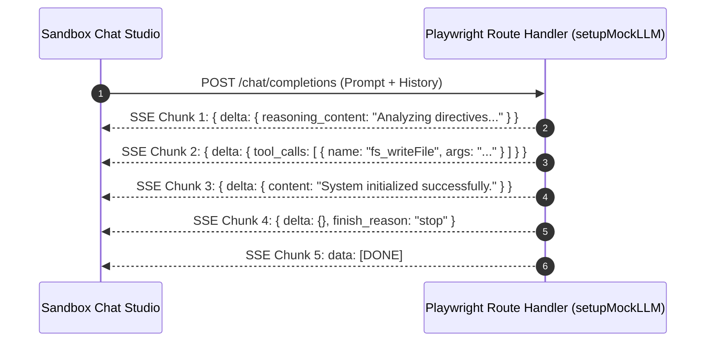
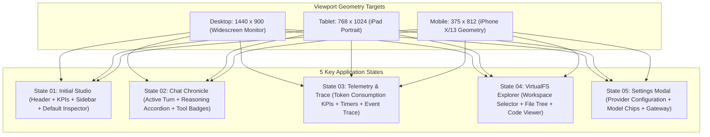

# End-to-End & Responsive Visual Testing Architecture

**Status:** CANONICAL
**Last verified: 2026-09-22**

> **Authoritative Technical Standard for Playwright Browser Automation & Multimodal Visual Verification**  
> *Target Systems: Sandbox Studio, Chat Chronicle, Agent Inspector, VirtualFS Explorer, Settings Modal, Responsive Visual Matrix*

---

## 1. Executive Summary

The Agentic Sandbox Studio End-to-End (E2E) testing framework utilizes **Playwright** (`@playwright/test`) to verify complete user journeys, reactive Svelte 5 component state machines, Server-Sent Events (SSE) streaming fidelity, and responsive visual layout parity across Desktop, Tablet, and Mobile viewports.



---

## 2. Test Configuration & Harness Architecture

### 2.1 Playwright Configuration (`playwright.config.js`)
The E2E suite configuration enforces strict deterministic isolation:
- **Sequential Worker Execution (`workers: 1`)**: The sandbox studio shares localized IndexedDB, `localStorage`, and in-memory caches. Running tests sequentially prevents cross-spec state collisions.
- **Web Server Integration**: Automatically spawns `npm run dev` (Vite) and polls `http://localhost:5173` before test execution starts.
- **Auditing & Reporting**: Generates standard list console logs, HTML reports (`playwright-report/`), and machine-readable JSON summaries (`playwright-report/results.json`).

```javascript
// Key extract from playwright.config.js
export default defineConfig({
  testDir: './tests/e2e',
  timeout: 45000,
  expect: { timeout: 10000 },
  fullyParallel: false,
  workers: 1,
  reporter: [
    ['list'],
    ['html', { open: 'never', outputFolder: 'playwright-report' }],
    ['json', { outputFile: 'playwright-report/results.json' }]
  ],
  use: {
    baseURL: 'http://localhost:5173',
    trace: 'on-first-retry',
    screenshot: 'only-on-failure',
    video: 'off'
  }
});
```

---

### 2.2 Test Harness & Helpers (`tests/e2e/helpers.js`)

#### 1. Zero-Error Auditor (`attachAuditor(page)`)
Traps and records all browser runtime errors during test execution:
- `page.on('console')`: Detects and flags any `console.error` emissions.
- `page.on('pageerror')`: Catches unhandled JavaScript exceptions, Svelte runtime errors, or uncaught promise rejections.
- `page.on('requestfailed')`: Catches unhandled network drops.
- `page.on('response')`: Captures unexpected HTTP `>= 400` status codes.

```javascript
// Pattern for verifying zero unhandled errors in all E2E specs
const auditor = attachAuditor(page);
await gotoSandbox(page);
// ... interactions ...
expect(auditor.pageErrors).toEqual([]);
```

#### 2. Seeded Navigation (`gotoSandbox(page)`)
Uses `page.addInitScript()` to inject valid mock provider credentials into `localStorage` prior to DOM initialization, avoiding setup prompts and directly loading `.sandbox-studio-root`.

#### 3. Deterministic SSE Mock Engine (`setupMockLLM(page, options)`)
Intercepts all outbound `POST **/chat/completions**` network requests and streams synthetically generated Server-Sent Events (SSE) adhering to the OpenAI/DeepSeek chunk protocol:



---

## 3. End-to-End Specification Breakdown

The E2E suite consists of **8 core specifications** located in [`tests/e2e/`](../../tests/e2e):

### 3.1 Spec 01: Navigation & Initial State
- **File**: [`tests/e2e/01-navigation-initial-state.spec.js`](../../tests/e2e/01-navigation-initial-state.spec.js)
- **Target Surfaces**: Header title, telemetry KPI chips (Agents, Running, Messages, Files, Timers), action toolbar, left agent drawer, studio navigation tabs.
- **Key Assertions**:
  - Validates default bootstrap of the Director meta-agent card with `.sudo-tag` badge.
  - Verifies seamless tab switching across **Chat Studio**, **Telemetry & Trace**, **Virtual Filesystem**, and **Messaging Bus**.
  - Verifies real-time agent filtering via `.drawer-search-input` (matching `director`, handling empty state `No agents registered.`).

---

### 3.2 Spec 02: Agent Provisioning & Character Customization
- **File**: [`tests/e2e/02-agent-provisioning-editing.spec.js`](../../tests/e2e/02-agent-provisioning-editing.spec.js)
- **Target Surfaces**: `AgentLauncherModal`, `AgentSettingsPanel`, Agent Sidebar Drawer.
- **Key Assertions**:
  - Provisions a new agent (`agent-scout-unit`, "Scout Unit 99", `collaborator` preset) and confirms appearance in active drawer.
  - Opens the Agent Settings tab from the studio header, modifies character name and role description, and asserts live state updates.
  - Tests duplicate agent ID collision prevention: attempting to launch an existing ID (e.g. `director`) triggers an inline error banner without closing the modal.

---

### 3.3 Spec 03: Multi-Agent Switching & Draft Isolation
- **File**: [`tests/e2e/03-multi-agent-switching-drafts.spec.js`](../../tests/e2e/03-multi-agent-switching-drafts.spec.js)
- **Target Surfaces**: Agent selection highlight, `.tab-target-badge`, Chat Chronicle swapping, input draft buffers.
- **Key Assertions**:
  - Switches active agent selection between `Director`, `Agent Alpha`, and `Agent Beta`, confirming active card highlight and chronicle header swapping.
  - Evaluates per-agent draft retention in both the **Inspector** (`#turn-prompt-input`) and **Chat Studio** (`.action-textarea`). Uncommitted draft text for Agent A remains preserved when switching away to Agent B and returning.

---

### 3.4 Spec 04: Turn Execution & Chat Chronicle Rendering
- **File**: [`tests/e2e/04-turn-execution-chat-rendering.spec.js`](../../tests/e2e/04-turn-execution-chat-rendering.spec.js)
- **Target Surfaces**: User message cards, Assistant message cards, reasoning accordions, inline tool badges, Markdown renderer, inline message editor.
- **Key Assertions**:
  - Submits a user prompt and verifies immediate rendering of `.turn-user` with `.action-prefix-label`.
  - Verifies collapsible thought process accordion (`.thinking-container`) displaying streamed reasoning thoughts.
  - Toggles inline tool invocation badge (`.inline-tool-badge`), expanding JSON arguments (`/system_init.json`).
  - Verifies Markdown prose formatting (headers `h3`, bold tags `strong`, lists).
  - Tests inline user message editing: activates `.micro-btn:has-text("Edit")`, updates text, saves, and asserts chronicle update.
  - Verifies System Directive whitespace preservation (ticket 4154694): `.system-body p` computes `white-space: pre-wrap` / `overflow-wrap: anywhere`, the multi-line root prompt keeps its line breaks, and an inline edit → save round-trips the multi-line text verbatim.

---

### 3.5 Spec 05: Undo / Redo State Machine & Shortcuts
- **File**: [`tests/e2e/05-undo-redo-state-machine.spec.js`](../../tests/e2e/05-undo-redo-state-machine.spec.js)
- **Target Surfaces**: Undo turn button, Inspector Redo button, history state stacks, keyboard shortcut listeners (`Ctrl+Z`, `Ctrl+Y`).
- **Key Assertions**:
  - Executes a conversation turn and triggers `.btn-undo-turn-header`. Verifies immediate removal of both user and assistant turns.
  - Switches to Inspector tab and asserts the Redo button is enabled with dynamic stack badge `Redo (1)`.
  - Clicks Redo, verifying complete restoration of the undone turn in the Chat Chronicle.
  - Tests keyboard shortcuts `Ctrl+Z` (undo) and `Ctrl+Y` (redo) dispatched directly to the action textarea.

---

### 3.6 Spec 06: Agent Inspector, VirtualFS & Handshake Demo
- **File**: [`tests/e2e/06-agent-inspector-virtualfs.spec.js`](../../tests/e2e/06-agent-inspector-virtualfs.spec.js)
- **Target Surfaces**: Inspector tabs (Trace, Telemetry, Sent Context), Timer scheduler, VirtualFS Explorer, JSON KeyPath query, Grep widget, Run Handshake Demo.
- **Key Assertions**:
  - Schedules a 30s diagnostic timer via the Inspector UI and verifies dynamic appearance and cancellation.
  - Asserts the realm-grouped workspace selector (ticket 7571ce5): Shared/Generic group headers, a realm-global pill with its resolved count, file creation inside the Realm's global partition, and isolation from the shared global file list.
  - Creates a new file `/config/server.json` via the VirtualFS file modal and inspects code viewer content.
  - Executes structured AST JSON KeyPath query (`$.server`) and asserts result value `Alpha-Omega`.
  - Executes regex grep search (`Alpha-Omega`) and verifies matching file result row.
  - Triggers **Run Handshake Demo** (`.btn-demo`): verifies step progression banner (`Handshake Complete`), demo logs drawer, generated files (`/mission_report.json`, `/orders.json`), and logged bus messages.

---

### 3.7 Spec 07: Settings Modal Parity
- **File**: [`tests/e2e/07-settings-modal-parity.spec.js`](../../tests/e2e/07-settings-modal-parity.spec.js)
- **Target Surfaces**: `SettingsCard`, provider select dropdown, model chips, API key mask toggle, tuning sliders.
- **Key Assertions**:
  - Opens settings modal from header action icon.
  - Verifies provider availability: **Runware**, **NanoGPT**, **DeepSeek Native**, and **Prem AI**.
  - Switches provider to NanoGPT and selects model quick chip (`Qwen 3.8 27B Obliterated`), asserting auto-fill of `#model-field-modal`.
  - Toggles password visibility eye button on the API key input.
  - Verifies sliders for Word Limit, Context Window, and Temperature.
  - Saves settings and confirms modal dismissal with healthy studio state.

---

### 3.8 Spec 08: Responsive Visual Capture Matrix
- **File**: [`tests/e2e/08-responsive-visual-capture.spec.js`](../../tests/e2e/08-responsive-visual-capture.spec.js)
- **Target Surfaces**: Multimodal responsive visual rendering across Desktop, Tablet, and Mobile viewports.
- **Key Assertions**: Captures 15 high-resolution full-page screenshot artifacts into `tests/e2e/screenshots/`.

---

## 4. Responsive Viewport Capture Matrix

The visual automation suite tests three canonical device form factors across 5 key application states:



### Complete Visual Baseline Targets:

| Viewport | Dimensions | Screenshot Filename | Description of State Captured |
|---|---|---|---|
| **Desktop** | `1440 x 900` | `desktop_01_initial_studio.png` | Full studio layout, header KPIs, active agent drawer, default telemetry tab. |
| **Desktop** | `1440 x 900` | `desktop_02_chat_with_tools.png` | Chat Studio with active user turn, reasoning accordion, and expanded tool badges. |
| **Desktop** | `1440 x 900` | `desktop_03_inspector_panel.png` | Inspector panel showing token consumption graphs and event stream traces. |
| **Desktop** | `1440 x 900` | `desktop_04_virtualfs_explorer.png` | VirtualFS explorer with workspace pills, file rows, and code viewer. |
| **Desktop** | `1440 x 900` | `desktop_05_settings_modal.png` | Settings modal overlay with provider options and model controls. |
| **Tablet** | `768 x 1024` | `tablet_01_initial_studio.png` | Medium-format portrait layout with responsive sidebar and tab wraps. |
| **Tablet** | `768 x 1024` | `tablet_02_chat_with_tools.png` | Tablet Chat Studio displaying user bubble, tool badge, and markdown prose. |
| **Tablet** | `768 x 1024` | `tablet_03_inspector_panel.png` | Tablet Inspector view with responsive timer form and metrics grid. |
| **Tablet** | `768 x 1024` | `tablet_04_virtualfs_explorer.png` | Tablet VirtualFS layout with vertical file list and code preview. |
| **Tablet** | `768 x 1024` | `tablet_05_settings_modal.png` | Tablet Settings modal with responsive sliders and provider chips. |
| **Mobile** | `375 x 812` | `mobile_01_initial_studio.png` | Mobile viewport with collapsed drawer toggle and wrapped KPI chips. |
| **Mobile** | `375 x 812` | `mobile_02_chat_with_tools.png` | Mobile Chat Studio with compact action textarea and responsive bubbles. |
| **Mobile** | `375 x 812` | `mobile_03_inspector_panel.png` | Mobile Inspector view with stacked telemetry cards. |
| **Mobile** | `375 x 812` | `mobile_04_virtualfs_explorer.png` | Mobile VirtualFS view with touch-friendly workspace selection. |
| **Mobile** | `375 x 812` | `mobile_05_settings_modal.png` | Mobile Settings modal with full-screen scrollable form. |

---

## 5. Execution Commands & Workflows

### 5.1 Standard Test Execution

```bash
# Run all Playwright E2E tests in headless mode
npm run test:e2e

# Run a specific E2E spec file
npx playwright test tests/e2e/04-turn-execution-chat-rendering.spec.js

# Run tests in headed browser mode (visible UI)
npx playwright test --headed

# Run tests with Playwright Interactive UI Debugger
npx playwright test --ui

# Run only the visual capture matrix spec
npx playwright test tests/e2e/08-responsive-visual-capture.spec.js
```

### 5.2 Live LLM Execution & `.env.local` Key Injection

Full end-to-end testing with real LLM providers requires live API keys. These are centrally maintained in `.env.local`:
- `DEEPSEEK_TEST_API_KEY`: DeepSeek Native completions
- `NANO_TEST_API_KEY`: NanoGPT multi-model routing
- `PREM_TEST_API_KEY`: Prem AI Reticle WASM & KEK enclave
- `RUNWARE_TEST_API_KEY`: Runware cloud visual generation

To execute E2E tests that perform real model turns in the browser, seed the provider keys into the Playwright MCP profile (see the secret-handling rules in [`exploratory_qa_plan.md`](exploratory_qa_plan.md)).
  await page.goto('/sandbox');
  // Execute live turns against real LLM endpoints...
});
```

### 5.3 Debugging & Trace Inspection

```bash
# View the HTML test report generated after execution
npx playwright show-report playwright-report

# Inspect recorded execution traces
npx playwright show-trace playwright-report/trace.zip
```

---

## 6. Sibling Documentation Links
- [Testing Strategy & Philosophy Reference](testing_strategy.md)
- [Unit and Integration Testing Reference](unit_and_integration.md)
- [Sandbox Resilience & UI Fidelity Specification](../requirements/sandbox_resilience_and_ui_fidelity.md)
- Turn Economics & Runtime Specification — retired proposal (not shipped)
