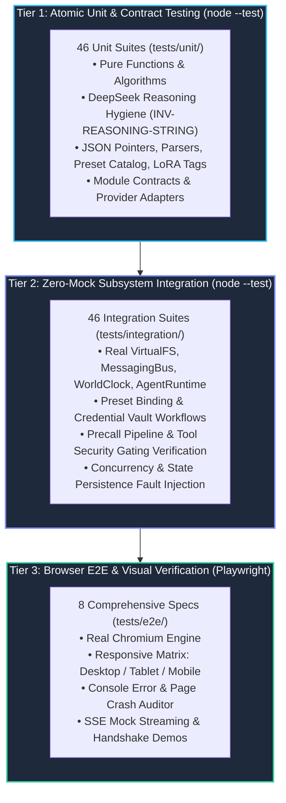
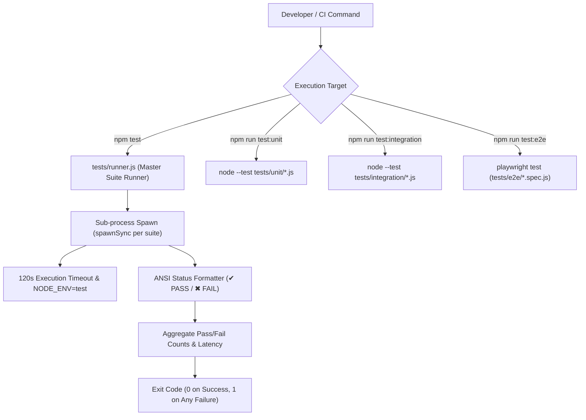

# Testing Strategy, Quality Assurance & Verification Architecture

**Status:** CANONICAL
**Last verified: 2026-09-22**

> **Authoritative Technical Standard for Agentic Sandbox Studio Test Engineering**  
> *Target Systems: Multi-Agent Sandbox Studio, AgentRuntime, VirtualFS, MessagingBus, ToolDispatcher, preset catalog & credential vault*

---

## 1. Executive Summary & Testing Philosophy

The Agentic Sandbox Studio platform employs a **multi-tier verification architecture** designed to guarantee mathematical determinism, zero data corruption, cryptographic security boundaries, and high visual fidelity across all agentic conversational surfaces. Because the platform executes multi-agent conversational state machines with tool invocation loops, virtualized filesystems, and provider-agnostic Large Language Model (LLM) streaming, traditional shallow mocking is insufficient to prove correctness.



---

## 2. Core Testing Principles

### 2.1 Multi-Tier Testing Pyramid
Testing is partitioned into three distinct validation tiers:
1. **Tier 1 (Unit & Contract)**: Fast, synchronous, deterministic micro-benchmarks and isolated algorithmic validations.
2. **Tier 2 (Zero-Mock Integration)**: Full in-memory orchestration of concrete classes (`VirtualFS`, `MessagingBus`, `AgentRuntime`, `WorldClock`, `TriggerQueue`, `ToolDispatcher`) executing multi-turn tool loops without stubbing internal class interactions.
3. **Tier 3 (End-to-End & Responsive Visual)**: Full browser execution via Playwright driving real DOM components, Svelte state transitions, and responsive layout capture across three canonical screen geometries.

### 2.2 The Zero-Mock Integration Mandate
A core architectural requirement across Tier 2 is the **Zero-Mock Mandate**:
- Never mock internal state managers, storage engines, messaging queues, or filesystem tree structures when verifying application invariants.
- Concrete instances of [`VirtualFS`](../../src/lib/sandbox/virtualFs/index.ts), [`MessagingBus`](../../src/lib/sandbox/messagingBus/index.ts), [`WorldClock`](../../src/lib/sandbox/worldClock/index.ts), and [`AgentRuntime`](../../src/lib/sandbox/runtime/index.ts) are wired together in real memory.
- Network boundaries are exercised only at the provider adapter seam: provider suites replace `globalThis.fetch` with deterministic wire-level stubs (status codes, SSE frames, stream aborts), while every sandbox class inside the boundary stays real.

### 2.3 Prohibition of Fake AST Tests & Synthetic Stubs
Synthetic AST stubs that mock compiler outputs or return pre-cooked schema fragments without executing runtime validation are strictly forbidden. All tool contracts, parameter parsing, type coercion, and JSON patch operations must pass through real schema checkers:
- JSON Schema Draft-07 compliance is validated directly against [`ALL_TOOL_DEFINITIONS`](../../src/lib/sandbox/toolDefinitions/index.ts).
- Type coercions (`toBoolean`, `toInteger`) are verified with dirty, real-world LLM output samples (`"true"`, `"1"`, `"yes"`, `"off"`, `NaN`, `null`).
- Prototype pollution guards (`normalizeToolName`, `resolveToolPreset`) are subjected to direct `__proto__`, `constructor`, and `toString` exploit payloads.

### 2.4 Real DOM & Browser Environment Execution
Tier 3 tests run inside authentic Chromium browser instances. Polyfills in Node.js unit runners ([`tests/test_env.js`](../../tests/test_env.js)) provide faithful DOM and storage emulation (`MockLocalStorage` with quota overflow simulation and Svelte 5 `$state` runes) so that lower tiers do not diverge from browser semantics.

### 2.5 Descriptive Domain Naming & Traceability
All test suites, test cases, and assertion blocks adhere to descriptive domain naming mapped directly to Acceptance Criteria (AC) and Invariants:
- Example: `Fail-Closed Capability Gating (only safe innate primitives on null/empty whitelist)`
- Example: `[INV-REASONING-STRING] Every synthetic assistant message with tool calls contains typeof reasoning_content === "string"`
- Example: `test('04: Turn Execution & Chat Log Rendering - executes a chat turn with reasoning, tool calls, and markdown response')`

---

## 3. Test Runner Architecture

The test infrastructure provides two complementary test execution paths: the **Custom Master Test Runner** ([`tests/runner.js`](../../tests/runner.js)) and the **Node Native Test Runner** (`node --test`).



### 3.1 Custom Master Test Runner (`tests/runner.js`)
The master runner executes all Unit and Integration suites in strict sub-process isolation:
- **Process Isolation**: Each test file is executed via `node:child_process.spawnSync('node', [suite.path])`, ensuring no memory leaks, uncollected timers, global state bleed, or prototype modifications pollute subsequent test suites.
- **Strict Timeouts**: Enforces a 120,000ms execution ceiling per test suite to catch deadlocks, hanging event listeners, or unresolved promises ([`tests/runner.js`](../../tests/runner.js)).
- **Clean Output Formatting**: Emits formatted ANSI summary lines with category padding, suite duration in milliseconds, and detailed error summaries (stdout/stderr captures) upon failure.
- **Fail-Fast Exit Codes**: Returns exit code `0` only when 100% of discovered suites pass cleanly; exits with `1` on any failure.

```javascript
// Sample output format from tests/runner.js:
// ======================================================================
//   AGENTIC SANDBOX STUDIO MASTER TEST SUITE RUNNER
//   Total Suites: 92 (46 Unit, 46 Integration)
// ======================================================================
//   [Unit       ] deepseek_provider_test.js                  ✔ PASS (42ms)
//   [Unit       ] deepseek_reasoning_hygiene_test.js         ✔ PASS (18ms)
//   ...
//   [Integration] tool_contract_security_gating_test.js      ✔ PASS (115ms)
//   [Integration] mail_injection_precall_pipeline_test.js    ✔ PASS (188ms)
// ======================================================================
//   Suites:       92 passed, 92 total
//   Failed:       0 failed
//   Duration:     3.42s
// ======================================================================
```

### 3.2 Browser & Environment Polyfill Harness (`tests/test_env.js`)
All Node-based test suites import [`tests/test_env.js`](../../tests/test_env.js) to initialize browser emulation primitives:
1. **`MockLocalStorage`**: In-memory `Map`-backed storage providing full `Storage` interface compliance (`getItem`, `setItem`, `removeItem`, `clear`, `key`, `length`), including explicit quota exhaustion simulation (`__simulateQuotaExceeded(true)` throwing DOM `QuotaExceededError` code 22).
2. **DOM Emulation**: Minimal `globalThis.window`, `globalThis.document` with `createElement`, `appendChild`, and `removeChild` mocks for blob anchor downloads.
3. **URL & Blob Object Mocking**: Deterministic `URL.createObjectURL` and `URL.revokeObjectURL` handlers.
4. **Svelte 5 Rune Emulation**: Native Node polyfills for Svelte 5 reactive primitives (`globalThis.$state = (v) => v`, `globalThis.$state.snapshot = (v) => structuredClone(v)`).

---

## 4. Test Suite Inventory & Classification

The project includes **92 native test suites** (46 unit, 46 integration) and **8 browser E2E specs**:

> **Canonical inventory.** This chapter is the single source of truth for test-suite counts and per-file listings; [`unit_and_integration.md`](unit_and_integration.md) cross-links here instead of duplicating it.

### 4.1 Unit Test Suites (`tests/unit/`)
| Suite File | Primary Target Module | Verification Focus |
|---|---|---|
| [`contracts_gate_test.js`](../../tests/unit/contracts_gate_test.js) | `scripts/verify_sandbox_contracts.js` + gate tooling | Seven static encapsulation gates execute and pass (verifier, dependency-cruiser, TSDoc, contract-types, module contracts, report freshness, sandbox lint). |
| [`custom_tool_gate_test.js`](../../tests/unit/custom_tool_gate_test.js) | `src/lib/sandbox/runtime/turnExecutionEngine/index.ts` | Custom-handler gate: wildcard/authority-only invocation, explicit allowlists insufficient, anonymous denial, schema exposure blocked, no name-shadow fallthrough. |
| [`deepseek_provider_test.js`](../../tests/unit/deepseek_provider_test.js) | `src/lib/sandbox/inference/DeepSeekProvider/index.ts` | DeepSeek adapter wire contract, SSE streaming, retry/backoff defaults. |
| [`deepseek_reasoning_hygiene_test.js`](../../tests/unit/deepseek_reasoning_hygiene_test.js) | `src/lib/sandbox/runtime/messageHygiene/` + `runtime/historyManager/` | Strict `reasoning_content` string invariant (`INV-REASONING-STRING`), reasoning eviction, orphan tool-call pruning. |
| [`descriptor_authority_hygiene_test.js`](../../tests/unit/descriptor_authority_hygiene_test.js) | `src/lib/sandbox/toolDefinitions/index.ts` + `tools/constants/index.ts` | Descriptor scope: identity-only caller forwarding, no authority-field leakage, `AuthorityDescriptor` allow-set gating. |
| [`domain_director_module_test.js`](../../tests/unit/domain_director_module_test.js) | `src/lib/sandbox/domain/directorAgent/index.ts` | Director domain contract, strict whitelist, verbatim directive integrity. |
| [`fs_download_utils_test.js`](../../tests/unit/fs_download_utils_test.js) | `src/lib/sandbox/fsDownloadUtils/index.ts` | VirtualFS folder/file download, upload, copy, Blob/ZIP packaging. |
| [`gitbug_wrapper_test.js`](../../tests/unit/gitbug_wrapper_test.js) | `scripts/gitbug.mjs` | git-bug wrapper safety: ref resolution without silent fallback, label validation, argv builders. |
| [`icd_a_history_test.js`](../../tests/unit/icd_a_history_test.js) | `src/lib/sandbox/runtime/historyManager/index.ts` + `tools/descriptors/lifecycleTools.ts` | ICD-A regressions: options-form emit resolution, `undo_turn` target selection, structured failure receipts. |
| [`invocation_engine_module_test.js`](../../tests/unit/invocation_engine_module_test.js) | `src/lib/sandbox/invocationEngine/index.ts` | Module 5 ICD contract, direct RPC dispatch, parameter normalization. |
| [`lora_tag_parser_test.js`](../../tests/unit/lora_tag_parser_test.js) | Self-contained parser contract | `<lora:name:weight>` parsing, prompt stripping, weight extraction. |
| [`markdown_parser_test.js`](../../tests/unit/markdown_parser_test.js) | `src/lib/components/sandbox/markdown/render.ts` | Prose rendering (GFM via `marked`) + DOMPurify allowlist sanitization (fail-closed fallback), XSS vectors. |
| [`messaging_bus_module_test.js`](../../tests/unit/messaging_bus_module_test.js) | `src/lib/sandbox/messagingBus/index.ts` | Module 2 ICD: strict dequeue on read, clean drain, non-destructive peek. |
| [`messaging_bus_realm_scope_test.js`](../../tests/unit/messaging_bus_realm_scope_test.js) | `src/lib/sandbox/messagingBus/index.ts` | Realm-scoped delivery: cross-realm direct/inline/broadcast denial, bypass principals, filtered fan-out, legacy parity. |
| [`model_config_module_test.js`](../../tests/unit/model_config_module_test.js) | `src/lib/sandbox/modelConfig/index.ts` | Strict export whitelist, 5-entry preset catalog, 100K token cap. |
| [`nanogpt_provider_test.js`](../../tests/unit/nanogpt_provider_test.js) | `src/lib/sandbox/inference/NanoGptProvider/index.ts` | NanoGPT adapter wire contract, routing headers, retry policy. |
| [`openai_provider_test.js`](../../tests/unit/openai_provider_test.js) | `src/lib/sandbox/inference/OpenAIProvider/index.ts` | Custom provider `url` enforcement, OpenAI-compatible streaming, retry. |
| [`precall_gate_adversarial_test.js`](../../tests/unit/precall_gate_adversarial_test.js) | `src/lib/sandbox/tools/descriptors/precallTools.ts` | Forbidden-precall gate adversarial coverage, allowlist resolution. |
| [`prem_provider_test.js`](../../tests/unit/prem_provider_test.js) | `src/lib/sandbox/inference/PremProvider/index.ts` | Prem adapter, encryption envelope, `listModels()` status validation. |
| [`preset_catalog_module_test.js`](../../tests/unit/preset_catalog_module_test.js) | `src/lib/sandbox/presetCatalog/` | Catalog seed/CRUD/persistence, active pointer + fallback default, immutability, event isolation. |
| [`realm_catalog_module_test.js`](../../tests/unit/realm_catalog_module_test.js) | `src/lib/sandbox/realmCatalog/index.ts` | Format v1: schema (origins/briefs/history/hydration), hydration-package validation, canonical transport + per-bundle `templateVersion`, composed baked history, origin-aware seed resolution, reserved-name/duplicate-slot rejection, per-agent `authorities` declarations (known vocabulary + unsupported-id gate, version-hash coverage). |
| [`realm_content_pipeline_test.js`](../../tests/unit/realm_content_pipeline_test.js) | `scripts/embed_realm_content.mjs` → `content.generated.ts` | Embed pipeline: UTF-8-only 256 KB/file cap, dangling-reference and unsafe-path rejection, `BAKED_TEMPLATE_BUNDLES` shape (demo + `session_zero`), `--check` freshness. |
| [`realm_launcher_helpers_test.js`](../../tests/unit/realm_launcher_helpers_test.js) | `src/lib/components/sandbox/realmLauncherHelpers.ts` + `realmReviewHelpers.ts` | Launcher preview projection, preset binding display, seed row parsing/validation, target options, error descriptors; registry controls, source labels, generated-input badges, history preview; review completion (authority approvals/trust display, payload attach, files-dialog provenance). |
| [`realm_registry_module_test.js`](../../tests/unit/realm_registry_module_test.js) | `src/lib/sandbox/realmRegistry/index.ts` | Realm record CRUD, frozen records, change events, storage adapter, invalid-entry dropping, instance-provenance freeze/validation/patch. |
| [`realm_store_ui_test.js`](../../tests/unit/realm_store_ui_test.js) | `src/lib/components/sandbox/realmGroups.ts` + `realmTemplateHelpers.ts` | Realm grouping order (Generic first), director pinning, orphan/empty-realm handling, `safeRealmColor` guard; template source labels, import/export/delete actions, review projection, provenance display helpers; candidate attach → review → launch → clear. |
| [`retry_test.js`](../../tests/unit/retry_test.js) | `src/lib/sandbox/inference/retry/index.ts` | Retry/backoff policy, abort-listener hygiene, retryability classification. |
| [`runtime_coordinator_module_test.js`](../../tests/unit/runtime_coordinator_module_test.js) | `src/lib/sandbox/runtime/index.ts` | Module 13 coordinator: factory DI, strict whitelist, orchestration. |
| [`runtime_execution_module_test.js`](../../tests/unit/runtime_execution_module_test.js) | `src/lib/sandbox/runtime/turnExecutionEngine/index.ts` | Module 10 turn execution: concurrency serialization, non-reentrancy. |
| [`runtime_lifecycle_module_test.js`](../../tests/unit/runtime_lifecycle_module_test.js) | `src/lib/sandbox/runtime/agent/`, `agentLifecycle/`, `historyManager/` | Module 9 lifecycle, pure `Agent`, universal modelConfig composition, baked-history seeding (`LaunchAgentOptions.history`, INV-7 ids). |
| [`runtime_scheduler_module_test.js`](../../tests/unit/runtime_scheduler_module_test.js) | `src/lib/sandbox/runtime/runtimeScheduler/index.ts`, `runtime/triggerDispatcher/index.ts` | Module 11 scheduler contract, trigger dispatch. |
| [`runtime_telemetry_module_test.js`](../../tests/unit/runtime_telemetry_module_test.js) | `src/lib/sandbox/runtime/runtimeTelemetry/index.ts` | Module 12 telemetry: defaults, capacity clamping, defensive snapshots. |
| [`runware_provider_test.js`](../../tests/unit/runware_provider_test.js) | `src/lib/sandbox/inference/RunwareProvider/index.ts` | Runware adapter wire contract, thinking-budget parameters, retry. |
| [`sandbox_persistence_module_test.js`](../../tests/unit/sandbox_persistence_module_test.js) | `src/lib/sandbox/sandboxPersistence/index.ts` | Module 6 persistence: export whitelist, schema validation, hydration; imported-template payloads + realm instance provenance round-trip. |
| [`sandbox_store_module_test.js`](../../tests/unit/sandbox_store_module_test.js) | `src/lib/sandbox/sandboxStore/index.svelte.ts` | Module 14 store: reactive state, substrate DI, encapsulation, realm registry projection/CRUD; template registry (import/export/delete, effective-catalog shadowing), package launch, caps/rollback, instance provenance, realm-scoped seed resolution; publishing grants + trust override, launch authority approvals, session-only pending payloads. |
| [`scheduler_realm_scope_test.js`](../../tests/unit/scheduler_realm_scope_test.js) | `src/lib/sandbox/runtime/runtimeScheduler/index.ts` + `triggerQueue/index.ts` | Realm-confined scheduling/cancel and trigger dispatch, bypass/internal paths, legacy parity. |
| [`settings_modal_presets_test.js`](../../tests/unit/settings_modal_presets_test.js) | `src/lib/components/sandbox/SandboxSettingsModal.svelte` + `presetCatalog`/`credentialVault` | Catalog-driven settings modal, official model catalogs, custom preset persistence, credential-vault separation (no `keyId` writes). |
| [`tool_alias_normalizer_test.js`](../../tests/unit/tool_alias_normalizer_test.js) | `src/lib/sandbox/tools/normalizers/aliasMap.ts`, `paramSanitizer.ts` + `tools/constants/index.ts` | Master alias map, precall allowlist, prototype-safe normalization, alias-map uniqueness/cross-family invariants, alias-written allowlist semantics. |
| [`tool_authorization_gate_test.js`](../../tests/unit/tool_authorization_gate_test.js) | `src/lib/sandbox/toolDefinitions/index.ts` | Descriptor-authoritative authorization: a present descriptor decides alone, no widen channels, innate universal, legacy only for descriptor-less callers. |
| [`tool_preset_resolve_test.js`](../../tests/unit/tool_preset_resolve_test.js) | `src/lib/components/sandbox/toolPresetResolve.ts` | Launcher preset resolution: empty custom whitelist denied (never wildcard), alias canonicalization, named presets. |
| [`tool_presets_optimization_test.js`](../../tests/unit/tool_presets_optimization_test.js) | `src/lib/sandbox/toolDefinitions/index.ts` + `runtime/index.ts` | Preset expansion (`readonly`, `manager`, `collaborator`), token reduction, AgentRuntime integration. |
| [`tool_system_module_test.js`](../../tests/unit/tool_system_module_test.js) | `src/lib/sandbox/toolDefinitions/index.ts`, `src/lib/sandbox/tools/` | Module 8: immutable contracts, Draft-07 schema generation, 35 canonical descriptors + the separate explicit-only publishing registry, error shielding. |
| [`trigger_queue_module_test.js`](../../tests/unit/trigger_queue_module_test.js) | `src/lib/sandbox/triggerQueue/index.ts` | Module 4 contract: export whitelist, encapsulation, trigger typing. |
| [`virtual_fs_module_test.js`](../../tests/unit/virtual_fs_module_test.js) | `src/lib/sandbox/virtualFs/index.ts`, `fsDownloadUtils/index.ts` | Module 1: POSIX paths, workspace isolation, pagination, JSON patch/query, grep; file-sourced plumbing (`source_file`/`append`/`replacement_source_file`/`data_source_file`/`value_file`/`output_file`) + `concat_files`. |
| [`virtual_fs_realm_scope_test.js`](../../tests/unit/virtual_fs_realm_scope_test.js) | `src/lib/sandbox/virtualFs/index.ts` | Realm-global alias resolution, realm ACL matrix, enumeration/grep confinement, `public` retirement. |
| [`world_clock_module_test.js`](../../tests/unit/world_clock_module_test.js) | `src/lib/sandbox/worldClock/index.ts` | Module 3: export whitelist, time projections, partition isolation, access control. |
| [`world_clock_realm_scope_test.js`](../../tests/unit/world_clock_realm_scope_test.js) | `src/lib/sandbox/worldClock/index.ts` + `tools/constants/index.ts` | Realm-qualified clock partitions/sync (`realm:<id>:global`), scoped enumeration/snapshots, clock-tool denial (direct + `batch_precall`), mutation-capability vocabulary completeness. |

### 4.2 Integration Test Suites (`tests/integration/`)
| Suite File | Subsystems Integrated | Verification Focus |
|---|---|---|
| [`agent_model_resolution_test.js`](../../tests/integration/agent_model_resolution_test.js) | `runtime/agent/` + `AgentRuntime` + `presetCatalog` | Universal `AgentModelConfig` resolution, catalog-default fallback, preset re-binding, compaction invariants. |
| [`agent_permissions_sudo_test.js`](../../tests/integration/agent_permissions_sudo_test.js) | `AgentRuntime` + `ToolDispatcher` | Permission presets, sudo/administrative authority, dynamic privilege reconfiguration. |
| [`agent_telemetry_debug_test.js`](../../tests/integration/agent_telemetry_debug_test.js) | `AgentRuntime` + `SandboxStore` + persistence | Token telemetry accumulation, debug context export, restore round-trip. |
| [`agent_workspace_view_test.js`](../../tests/integration/agent_workspace_view_test.js) | `AgentRuntime` + `TurnExecutionEngine` + `VirtualFS` | Agent workspace view: private-by-default `/`, `/global`/`/agents` mounts, engine workspace binding, tool-arg workspace claims inert, receipt opacity, legacy `/global` read compat. |
| [`director_scope_isolation_test.js`](../../tests/integration/director_scope_isolation_test.js) | `AgentRuntime` + `AgentLifecycleManager` + `MessagingBus` + `InvocationEngine` | Director system-scope isolation: never listed/addressed to agents (exact ids), one-way bypass delivery with true sender, reserved-id minting denied, system scope distinct from ungrouped. |
| [`event_stream_message_trace_test.js`](../../tests/integration/event_stream_message_trace_test.js) | `runtime/messageHygiene/*` + `AgentRuntime` + `SandboxStore` | SSE/message trace ordering, history hygiene, compaction. |
| [`interrupted_turn_resend_test.js`](../../tests/integration/interrupted_turn_resend_test.js) | `AgentRuntime` + `SandboxStore` | Interrupted turn undo/resend, duplicate prevention, persistence round-trip. |
| [`invocation_engine_test.js`](../../tests/integration/invocation_engine_test.js) | `InvocationEngine` + `MessagingBus` | Standalone invocation, secondary stream isolation, zero mail pollution. |
| [`lifecycle_workspace_eviction_test.js`](../../tests/integration/lifecycle_workspace_eviction_test.js) | `AgentRuntime` + `AgentLifecycleManager` + `VirtualFS` | Destructive kill/purge evict the resolved workspace key (`config.workspaceId \|\| agentId`), never peers/global/raw-id workspaces. |
| [`list_agents_projection_test.js`](../../tests/integration/list_agents_projection_test.js) | `ToolDispatcher` + `AgentRuntime` | `list_agents` returns scoped safe descriptors (no config/history/allowlists); anonymous empty, ordinary caller self+children (director never listed), root same-scope, operator unscoped. |
| [`mail_injection_precall_pipeline_test.js`](../../tests/integration/mail_injection_precall_pipeline_test.js) | `AgentRuntime` + `MessagingBus` + `VirtualFS` | Zero-inference mail injection, next-turn precalls, tombstone compaction. |
| [`messaging_bus_test.js`](../../tests/integration/messaging_bus_test.js) | `MessagingBus` | FIFO mailbox: dequeue on read, clean drain, peek, archive fidelity. |
| [`messaging_invocations_test.js`](../../tests/integration/messaging_invocations_test.js) | `MessagingBus` + `InvocationEngine` + `AgentRuntime` | Event-driven multi-agent flows, history purity, cascade execution. |
| [`operator_realm_injection_test.js`](../../tests/integration/operator_realm_injection_test.js) | `SandboxStore` + `TurnExecutionEngine` + `MessagingBus` | Operator-attributed injection and manual sends into realm-bound targets; agent cross-realm denial; no-director fail-closed. |
| [`modern_settings_workflow_test.js`](../../tests/integration/modern_settings_workflow_test.js) | `PresetCatalog` + `CredentialVault` + provider adapters | Modern settings workflow, progressive disclosure, live balance separation. |
| [`persistence_purge_test.js`](../../tests/integration/persistence_purge_test.js) | `sandboxPersistence` + `SandboxStore` | Recycle-bin serialization, zero-zombie hydration, hard purge governance. |
| [`preset_binding_runtime_test.js`](../../tests/integration/preset_binding_runtime_test.js) | `presetCatalog` + `AgentRuntime` + `Agent` | Binding-only agents: preset resolution at launch/turn start, credential rotation, hydration healing. |
| [`realm_identity_projection_test.js`](../../tests/integration/realm_identity_projection_test.js) | `AgentRuntime` + `runtime/agent` + `worldClock` | Realm identity projection (`realmId`/`realmBypass`), launch inheritance, immutable membership (all realm moves denied, operator included), snapshot round-trip, end-to-end clock sync target. |
| [`realm_identity_matrix_test.js`](../../tests/integration/realm_identity_matrix_test.js) | `AgentRuntime` + `AgentLifecycleManager` + `MessagingBus` + `VirtualFS` + `WorldClock` + `RuntimeScheduler` | Cross-realm identity matrix: canonical `(realmId, agentId)` keys, same-literal-id pairs across realms stay distinct, scope-aware visibility/listings, cross-realm denial across mail/invoke/VFS/schedules/clock. |
| [`realm_launch_seed_test.js`](../../tests/integration/realm_launch_seed_test.js) | `SandboxStore` + `realmCatalog` + `AgentRuntime` + `VirtualFS` | Template launch (ids/membership/grants/presets), rollback with no residue, seed into realm-global/member workspaces, operator-attributed directive. |
| [`realm_publishing_tools_test.js`](../../tests/integration/realm_publishing_tools_test.js) | `ToolDispatcher` + `runtime` + `realmCatalog` + `SandboxStore` + `sandboxPersistence` | Publishing: `AgentSpec.authorities` shape/hash, explicit-grant-only `import_realm_template`/`submit_hydration_package` (wildcard/privileged denied, schema-exposure filtering), manifest `sourceFile` resolution + caps, `dry_run` zero side effects, launch approval/trust override, candidate lifecycle, persistence round-trip, kill/purge and smuggling denials. |
| [`realm_scheduler_scope_test.js`](../../tests/integration/realm_scheduler_scope_test.js) | `AgentRuntime` + `RuntimeScheduler` + `TriggerQueue` + `MessagingBus` | Realm-confined wake/cancel end-to-end: broadcast early-cancel cannot cross realms, foreign schedule/cancel denied, legacy parity. |
| [`realm_template_multi_instance_test.js`](../../tests/integration/realm_template_multi_instance_test.js) | `SandboxStore` + `realmCatalog` + `AgentRuntime` + `VirtualFS` | One template, multiple realms in one store: per-realm ids/prompts/digests, package + seed isolation across realm-global/member workspaces, cross-instance denials, no turn/mail leakage. |
| [`realm_tool_scope_conformance_test.js`](../../tests/integration/realm_tool_scope_conformance_test.js) | `ToolDispatcher` + `AgentRuntime` + `VirtualFS` + `MessagingBus` + `RuntimeScheduler` | Conformance: 35-tool classification table (fails on unclassified/unevaluated tools), correct-id adversarial matrix across mail/invoke/wait/kill/restore/VFS/schedules/clock, agent-visible receipt opacity, director sweep, realm-model sweep. |
| [`realm_visibility_lifecycle_test.js`](../../tests/integration/realm_visibility_lifecycle_test.js) | `AgentRuntime` + `AgentLifecycleManager` + `InvocationEngine` | Realm visibility predicate, same-realm kill/restore/invoke gates, authenticated `wait_for_invocation`, resolved-creator parentage binding. |
| [`runtime_resilience_persistence_test.js`](../../tests/integration/runtime_resilience_persistence_test.js) | `sandboxPersistence` + `AgentRuntime` | Atomic snapshots, crash recovery, persistence locking, clock monotonicity. |
| [`session_zero_generator_realm_test.js`](../../tests/integration/session_zero_generator_realm_test.js) | `templates/session_zero` + `realmCatalog` + `SandboxStore` + `AgentRuntime` + `VirtualFS` | Shipped generator realm: bundle contract, launch approvals/trust recorded, Architect dry-run → import → handoff, Genesis `source_file` assembly → dry-run → submit → candidate, privileged peer workspace reads, candidate attach seeding. |
| [`settings_modal_modern_test.js`](../../tests/integration/settings_modal_modern_test.js) | `CredentialVault` + `inference/index.ts` | Catalog/vault settings architecture, provider registry, fixed 100K token cap. |
| [`spawn_receipt_opacity_test.js`](../../tests/integration/spawn_receipt_opacity_test.js) | `ToolDispatcher` + `AgentRuntime` | `spawn_agent` receipt bounded projection (no raw `Agent`/`realmId`), denial opacity, workspace-label sanitization, real-turn history receipt. |
| [`studio_recycle_bin_test.js`](../../tests/integration/studio_recycle_bin_test.js) | `SandboxStore` + `AgentRuntime` | Recycle bin state, badge counters, restore/purge lifecycle. |
| [`template_baked_history_test.js`](../../tests/integration/template_baked_history_test.js) | `SandboxStore` + `realmCatalog` + `AgentRuntime` + persistence | Baked prologue opener: system + declared history present before any turn, no model call, launch-generated message ids (INV-7), byte-stable runtime/store snapshot round-trips. |
| [`template_package_launch_test.js`](../../tests/integration/template_package_launch_test.js) | `SandboxStore` + `realmCatalog` + `VirtualFS` + `AgentRuntime` | Hydration-package launch: generated input composition (review values win), origin-aware seed files into realm-global/member workspaces, required/fixed/unknown rejections, version-mismatch policy, providers gate with zero side effects. |
| [`template_persistence_roundtrip_test.js`](../../tests/integration/template_persistence_roundtrip_test.js) | `SandboxStore` + `sandboxPersistence` + `realmRegistry` | Imported bundle + provenance persistence: fresh-store hydration, canonical export equality, source labels, caps/quota typed rollback. |
| [`template_roundtrip_test.js`](../../tests/integration/template_roundtrip_test.js) | `SandboxStore` + `realmCatalog` | Transport round-trip: import → export → re-import identical `templateBundleVersion`, shipped→imported catalog resolution, shadow/delete-restore semantics. |
| [`terminal_batch_precall_test.js`](../../tests/integration/terminal_batch_precall_test.js) | `AgentRuntime` + `ToolDispatcher` | `batch_precall` terminal batches, closing summary carrier, execution semantics. |
| [`timer_rewire_after_restore_test.js`](../../tests/integration/timer_rewire_after_restore_test.js) | `AgentRuntime` + `MessagingBus` | Listener lifecycle across `reset()` and `importSnapshot()`. |
| [`tool_compaction_hygiene_test.js`](../../tests/integration/tool_compaction_hygiene_test.js) | `runtime/messageHygiene/toolCompaction` + `AgentRuntime` | Active-turn content retention, historical tombstone compaction (`evicted_from_history`). |
| [`tool_contract_security_gating_test.js`](../../tests/integration/tool_contract_security_gating_test.js) | `ToolDispatcher` + `VirtualFS` + `WorldClock` | 35 canonical tools + explicit-only publishing tools, fail-closed security gating, preset resolution, aliases. |
| [`tool_schemas_security_test.js`](../../tests/integration/tool_schemas_security_test.js) | `src/lib/sandbox/toolDefinitions/` + alias normalizers | JSON Schema Draft-07 conformance, whitelisting, injection immunity. |
| [`trigger_queue_test.js`](../../tests/integration/trigger_queue_test.js) | `TriggerQueue` + `AgentRuntime` | Asynchronous trigger deduplication, debounce execution, concurrency limits. |
| [`turn_completion_resilience_test.js`](../../tests/integration/turn_completion_resilience_test.js) | `AgentRuntime` + `toolDefinitions` + persistence | Summary carrier, intentional completion, precall revalidation, fault containment. |
| [`undo_redo_draft_resilience_test.js`](../../tests/integration/undo_redo_draft_resilience_test.js) | `AgentRuntime` + `SandboxStore` | Undo/redo dual stacks, per-agent draft persistence, non-destructive error observability. |
| [`virtual_fs_messaging_integrity_test.js`](../../tests/integration/virtual_fs_messaging_integrity_test.js) | `VirtualFS` + `MessagingBus` + `InvocationEngine` | Cross-workspace data integrity, wait determinism, invocation robustness. |
| [`virtual_fs_pagination_test.js`](../../tests/integration/virtual_fs_pagination_test.js) | `VirtualFS` + `toolDefinitions` | readFile offset/line slicing, alias coercion, pagination metadata. |
| [`wait_for_invocation_auth_test.js`](../../tests/integration/wait_for_invocation_auth_test.js) | `ToolDispatcher` + `AgentRuntime` + `InvocationEngine` | Tool-path await auth: invoker/target/bypass allowed, unrelated/anonymous denied, forged scope claims inert. |
| [`world_clock_persistence_test.js`](../../tests/integration/world_clock_persistence_test.js) | `WorldClock` + `SandboxStore` + persistence | Clock advancement, event registration, persistence across reloads. |

### 4.3 End-to-End Test Specs (`tests/e2e/`)
| Spec File | Area Tested | Key Assertions & Interactions |
|---|---|---|
| [`01-navigation-initial-state.spec.js`](../../tests/e2e/01-navigation-initial-state.spec.js) | Studio Navigation & Initial State | Studio header, telemetry KPI chips, default Director agent, 4 tab navigation buttons, search filter. |
| [`02-agent-provisioning-editing.spec.js`](../../tests/e2e/02-agent-provisioning-editing.spec.js) | Agent Provisioning & Editing | Launch modal, provider/modelConfig selection, duplicate ID collision error banner, character metadata editing. |
| [`03-multi-agent-switching-drafts.spec.js`](../../tests/e2e/03-multi-agent-switching-drafts.spec.js) | Agent Switching & Draft Retention | Switching active agent cards, chronicle swapping, per-agent input draft preservation across tabs. |
| [`04-turn-execution-chat-rendering.spec.js`](../../tests/e2e/04-turn-execution-chat-rendering.spec.js) | Turn Execution & Chat Chronicle | Mock LLM streaming, reasoning accordion toggle, tool call badges, markdown rendering, inline turn editing, System Directive whitespace preservation. |
| [`05-undo-redo-state-machine.spec.js`](../../tests/e2e/05-undo-redo-state-machine.spec.js) | Undo/Redo & Keyboard Shortcuts | Undo turn button, Redo stack count badge, Ctrl+Z / Ctrl+Y keyboard shortcut triggers. |
| [`06-agent-inspector-virtualfs.spec.js`](../../tests/e2e/06-agent-inspector-virtualfs.spec.js) | Inspector, VirtualFS & Handshake Demo | Telemetry metrics, timer scheduling, realm-grouped workspace partitions (shared + realm-global), VFS file creation, AST KeyPath query, Grep search, Handshake demo. |
| [`07-settings-modal-parity.spec.js`](../../tests/e2e/07-settings-modal-parity.spec.js) | Catalog Settings Modal & Vault | Preset select/create/edit/activate, credential vault add/set-active, Escape and close behavior. |
| [`08-responsive-visual-capture.spec.js`](../../tests/e2e/08-responsive-visual-capture.spec.js) | Responsive Capture Matrix | Multi-viewport screenshot generation (Desktop 1440x900, Tablet 768x1024, Mobile 375x812). |

---

## 5. CI/CD Verification Protocols & Quality Gates

Every code modification must traverse four mandatory sequential validation gates before merge authorization:

```mermaid
sequenceDiagram
    autonumber
    actor Dev as Developer / CI Agent
    participant G1 as Gate 1: Static Lint & Schema Sync
    participant G2 as Gate 2: Master Test Suite (Unit + Integration)
    participant G3 as Gate 3: Production Build (Vite)
    participant G4 as Gate 4: Playwright E2E & Visual Suite

    Dev->>G1: git pre-commit / CI trigger
    Note over G1: Schema sync check (35 canonical tools + explicit-only publishing registry across Registry, Schemas, Dispatcher, Docs)
    G1-->>Dev: Gate 1 Passed (0 lint / sync errors)

    Dev->>G2: npm test (tests/runner.js)
    Note over G2: Executes 92 suites (46 Unit, 46 Integration) under 120s timeout
    G2-->>Dev: Gate 2 Passed (92/92 passed, 0 failures)

    Dev->>G3: npm run build (vite build)
    Note over G3: Compiles Svelte 5 runes, WASM modules, top-level awaits
    G3-->>Dev: Gate 3 Passed (vite build clean; tsc 0 total / 0 sandbox errors)

    Dev->>G4: npm run test:e2e (playwright test)
    Note over G4: Spins up Vite dev server, runs 8 specs across 3 viewports, checks console errors
    G4-->>Dev: Gate 4 Passed (All user journeys verified, 0 page errors)
```

### 5.1 Verification Commands Reference

```bash
# 1. Run the default static battery (contracts, module contracts, contract types, api-report freshness, arch, lints, typecheck)
npm run verify

# 2. Run Complete Master Test Suite (Unit + Integration)
npm test

# 3. Run Unit Test Suites Only
npm run test:unit

# 4. Run Integration Test Suites Only
npm run test:integration

# 5. Run Playwright Browser E2E Suite (Headless)
npm run test:e2e

# 6. Run Playwright in Interactive UI Mode
npx playwright test --ui

# 7. Run Production Build Verification Gate
npm run build
```

### 5.2 Environment Variables & Live LLM Test Credentials (`.env.local`)

All integration tests, Playwright E2E tests, and provider unit tests that require live LLM completions or provider validation resolve their credentials from `.env.local`:

```env
DEEPSEEK_TEST_API_KEY=sk-...
NANO_TEST_API_KEY=sk-nano-...
PREM_TEST_API_KEY=sk_live_...
RUNWARE_TEST_API_KEY=...
```

| Variable | Type | Default | Purpose |
|---|---|---|---|
| `DEEPSEEK_TEST_API_KEY` | String | `.env.local` | Live DeepSeek API key for DeepSeek Native provider tests. |
| `NANO_TEST_API_KEY` | String | `.env.local` | Live NanoGPT API key for NanoGPT routing & creative-writing model tests. |
| `PREM_TEST_API_KEY` | String | `.env.local` | Live Prem AI API key for Prem AI Reticle WASM & KEK enclave tests. |
| `RUNWARE_TEST_API_KEY` | String | `.env.local` | Live Runware API key for cloud visual scene synthesis tests. |
| `NODE_ENV` | String | `'test'` | Signals testing environment; suppresses non-critical logging. |
| `CI` | Boolean | `undefined` | Disables interactive prompts and dev-server reuse in Playwright. |
| `PLAYWRIGHT_BASE_URL` | String | `'http://localhost:5173'` | Target URL for Playwright browser automation. |

> [!IMPORTANT]
> **MANDATE FOR LLM-DEPENDENT TESTS**: Real E2E and LLM integration testing requires full API keys. All subagents and automated test suites performing live model inference must load these credentials via `tests/test_env.js` (Node.js). Playwright browser secrets are seeded into the MCP profile per [`exploratory_qa_plan.md`](exploratory_qa_plan.md).

---

## 6. Sibling Documentation Links
- [Unit and Integration Testing Reference](unit_and_integration.md)
- [End-to-End and Responsive Visual Testing Reference](e2e_and_visual.md)
- Turn Economics & Runtime Specification — retired proposal (not shipped)
- [Unified Provider & Model Architecture](../requirements/unified_provider_and_model_architecture.md)
