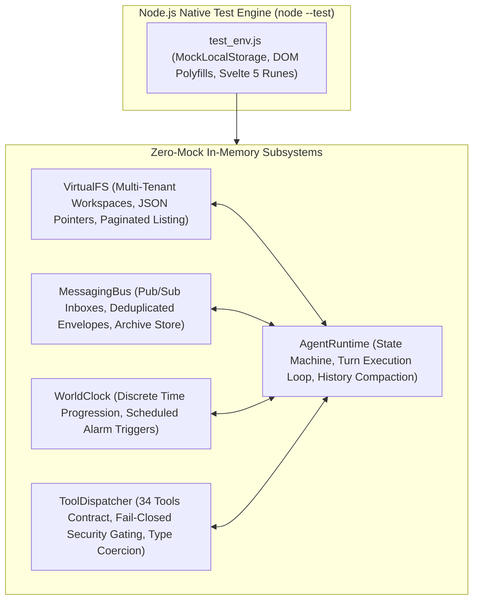
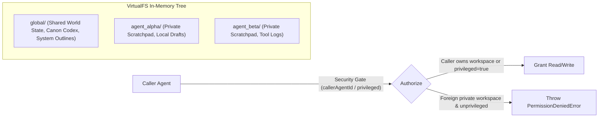
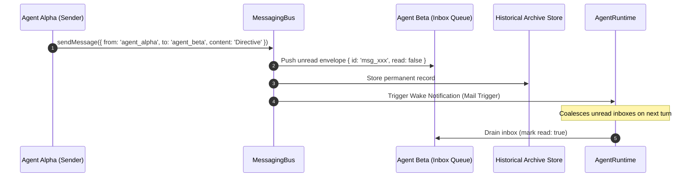
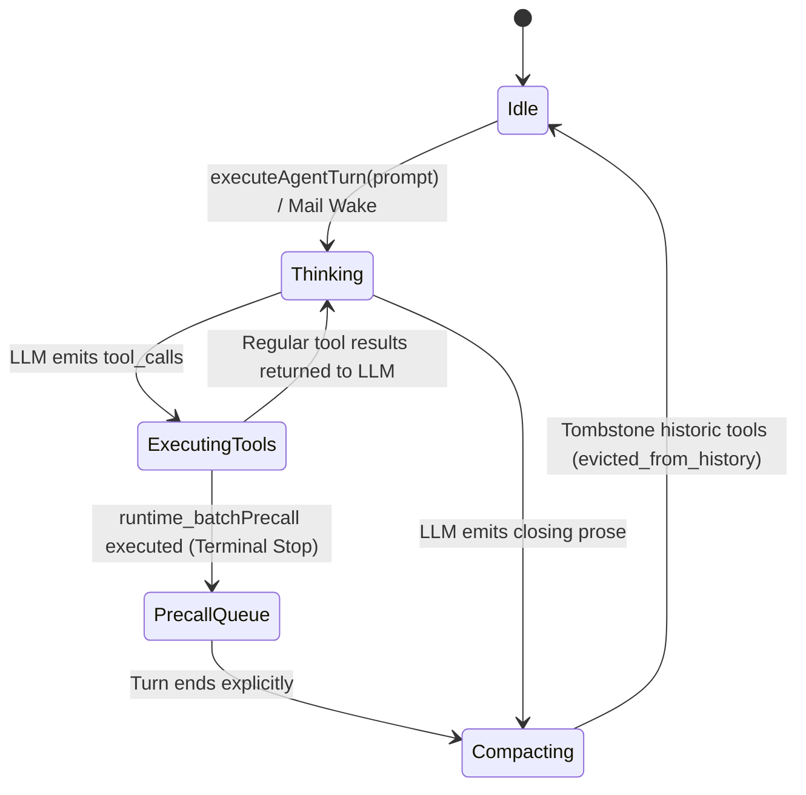
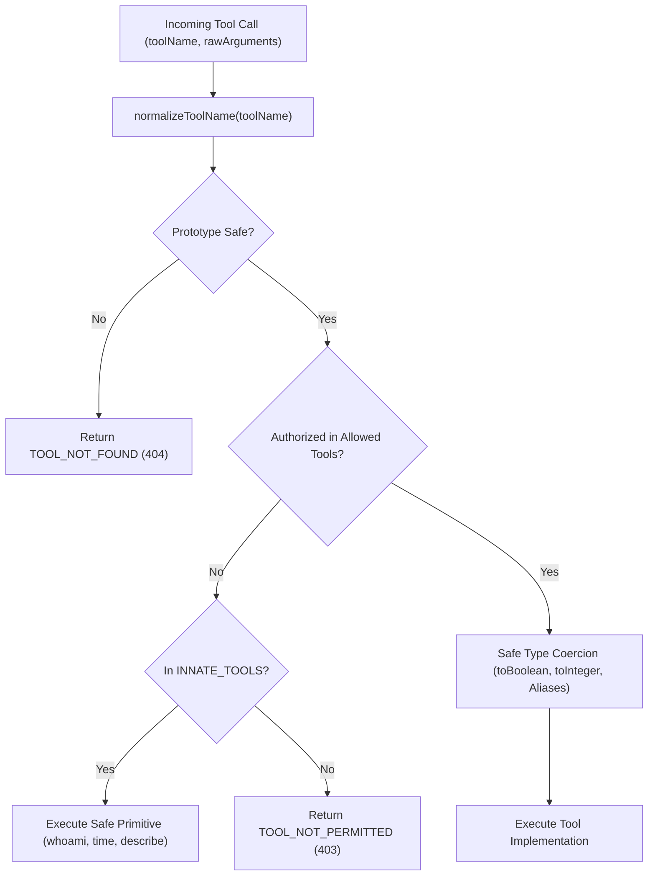
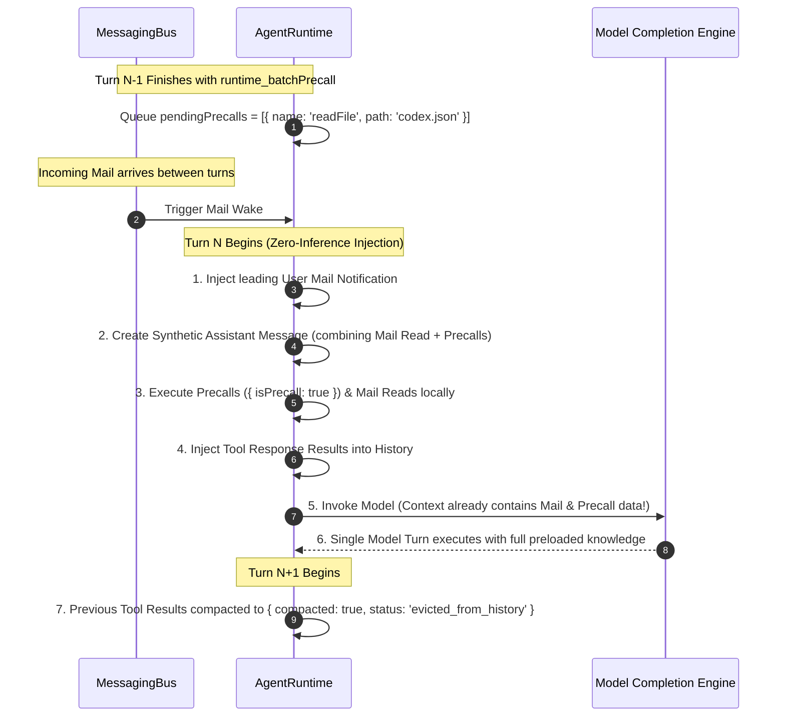

# Unit & Integration Testing Architecture

**Status:** CANONICAL
**Last verified: 2026-09-22**

> **Comprehensive Technical Guide to Zero-Mock Subsystem Verification**  
> *Target Modules: Node Native Test Runner, AgentRuntime, VirtualFS, MessagingBus, WorldClock, ToolDispatcher, preset catalog & credential vault*

---

## 1. Overview & Execution Architecture

The Agentic Sandbox Studio unit and integration test suites run under the native Node.js test runner (`node --test`) using strict assertions (`node:assert/strict`). The test suite comprises **52 unit test suites** and **46 integration test suites**, executing with zero mocks for core application classes.

> **Canonical inventory.** The per-file suite inventory is maintained in [Testing Strategy — §4 Test Suite Inventory](testing_strategy.md#4-test-suite-inventory--classification); this document covers architecture and verification semantics.

---

## 2. Zero-Mock Subsystem Execution

### 2.1 `VirtualFS` — Virtualized Multi-Tenant Filesystem
[`VirtualFS`](../../src/lib/sandbox/virtualFs/index.ts) manages an in-memory hierarchical filesystem partitioned into distinct workspace tenants (`global` and per-agent workspaces).

#### Key Architectural Invariants Verified:
1. **Workspace Isolation**: Non-privileged agents can only access their own private workspace (`agentId`) or the `global` workspace. Attempts to access other agents' private workspaces throw typed [`PermissionDeniedError`](../../src/lib/sandbox/virtualFs/index.ts#L43).
2. **JSON Pointer & KeyPath Engine**: Evaluates RFC 6901 JSON pointers (e.g. `/nodes/node-0001/metrics/cpuUsagePercent`) and JSONPath queries without full document re-parsing.
3. **Lenient JSON Patch (Option A Addendum)**: Implements auto-upsert semantics where `op: "replace"` targeting a missing property automatically coerces to `op: "add"`, and intermediate array/object containers are automatically initialized.
4. **Offset & Limit Pagination**: Handles directory listings exceeding 1,000 nodes using deterministic pagination offsets and limit windows.

---

### 2.2 `MessagingBus` — Asynchronous Agent Interconnect
[`MessagingBus`](../../src/lib/sandbox/messagingBus/index.ts) provides zero-inference message routing, persistent envelope archiving, and priority wake dispatch.

#### Invariants Verified:
1. **Single-Turn Coalescing**: Multiple envelopes sent during intermediate execution steps are coalesced into a single wake notification containing all unread messages.
2. **Archive Filtering & Inspection**: Archived messages remain permanently queryable by `sender`, `recipient`, and `timestamp` even after active inboxes are drained.
3. **Deterministic Envelope Delivery**: Envelopes maintain strict monotonicity in sequence numbering and timestamps.

---

### 2.3 `AgentRuntime` — Execution State Machine & Lifecycle
[`AgentRuntime`](../../src/lib/sandbox/runtime/index.ts) orchestrates multi-agent conversation turns, tool invocation loops, context compaction, and memory isolation.

#### Invariants Verified:
1. **Turn Loop Termination**: The runtime terminates upon model prose output or explicit `runtime_batchPrecall` terminal stop tool execution.
2. **History ID Backfilling**: [`ensureHistoryMessageIds`](../../src/lib/sandbox/runtime/historyManager/index.ts) guarantees unique alphanumeric IDs across all legacy and synthetic messages.
3. **Graceful Error Recovery**: LLM timeouts, malformed JSON, and tool execution failures are captured as tool error responses without crashing the runtime loop.

---

### 2.4 `ToolDispatcher` & Security Gating
The [`ToolDispatcher`](../../src/lib/sandbox/toolDefinitions/index.ts) is the fail-closed authorization gateway governing all 34 canonical tools.

#### Canonical Tool Presets Matrix:
| Preset Name | Tool Count | Permitted Capabilities | Restrictions |
|---|---|---|---|
| `all` / `*` | 34 | Full unconstrained access to all tools | Reserved for privileged Director / Admin |
| `manager` | 25 | File read/write/patch, messaging, agent spawning, scheduling | Restricted from system clock overrides and sudo escalations |
| `collaborator`| 24 | File read/write, messaging, inbox operations, precalls | Cannot spawn agents or modify global configurations |
| `readonly` | 12 | `read_file`, `query_json`, `list_files`, `grep`, `whoami`, `time` | **Strictly no file writes, deletes, patches, or messaging** |
| `null` / `[]` | 4 | Safe innate primitives only (`whoami`, `time`, `describeTool`, `batchPrecall`)| Fail-closed zero-capability baseline |

---

## 3. DeepSeek Reasoning Hygiene (`INV-REASONING-STRING`)

When integrating with reasoning LLMs (such as DeepSeek-R1 / DeepSeek-V4-Flash) that stream deliberation chains via `reasoning_content`, strict formatting invariants must be maintained:

> [!IMPORTANT]
> **Invariant `INV-REASONING-STRING`**:
> Every `assistant` role message that contains `tool_calls` **MUST** include a string primitive for `reasoning_content` (e.g. `reasoning_content: ""`). If `reasoning_content` is `undefined` or `null`, provider gateway APIs reject the entire payload with a 400 Bad Request error.

### Hygiene Functions Verified in `deepseek_reasoning_hygiene_test.js`:
- [`formatMessagesWithToolHygiene(history, options)`](../../src/lib/sandbox/runtime/messageHygiene/formatMessages.ts):
  - Guarantees `typeof msg.reasoning_content === 'string'` on all assistant messages.
  - Automatically evicts completed reasoning from earlier turns by default to optimize token context windows while preserving the current turn's thoughts.
  - Prunes orphaned tool calls lacking matching tool responses, and deep-clones inbound messages so callers are never mutated.
- [`compactHistoricalToolContent(toolName, rawContent)`](../../src/lib/sandbox/runtime/messageHygiene/toolCompaction.ts): tombstones historical tool receipts (see §4).
- Prem AI transport mirrors `reasoning` / `thought` deltas into `reasoning_content` internally in the Prem provider adapter (`src/lib/sandbox/inference/PremProvider/`).

---

## 4. Synthetic Mail Injection & Precall Pipeline

[`mail_injection_precall_pipeline_test.js`](../../tests/integration/mail_injection_precall_pipeline_test.js) validates the mail-injection and precall acceptance criteria:

### Verified Acceptance Criteria:
- **Zero-Inference Mail Delivery**: Messages are injected via synthetic tool exchanges without consuming unnecessary LLM decision turns.
- **Precall Pipeline Execution**: Queued precalls execute prior to model token generation and emit `{ isPrecall: true }` telemetry events.
- **Precall Error Resilience**: Missing files or tool errors during precall execution are returned as tool error payloads without halting the conversation turn.
- **Compaction Fidelity**: Historical tool outputs from prior turns are tombstoned into lightweight status receipts (`evicted_from_history`), saving up to 85% of input token context.

---

## 5. Telemetry, Assertion Helpers & LLM Provider Credentials

### 5.1 Telemetry Metrics
Integration tests track token economics, latency, and tool invocations via [`agent.telemetry`](../../src/lib/sandbox/runtime/runtimeTelemetry/index.ts):

| Metric Field | Type | Description |
|---|---|---|
| `agent.telemetry.injectedDeliveries` | Integer | Total count of synthetic zero-inference mail wake injections. |
| `agent.telemetry.precallCount` | Integer | Total count of preloaded precalls executed prior to model inference. |
| `agent.telemetry.terminalStops` | Integer | Count of turns explicitly concluded via `runtime_batchPrecall`. |
| `agent.telemetry.totalPromptTokens` | Integer | Cumulative prompt tokens consumed across all turns. |
| `agent.telemetry.totalCompletionTokens`| Integer | Cumulative completion tokens generated. |
| `agent.telemetry.totalTurns` | Integer | Total conversational turns executed. |

### 5.2 LLM Provider Credentials (`.env.local`)
Tests executing real LLM provider requests (e.g. `tests/unit/nanogpt_provider_test.js`, `tests/unit/prem_provider_test.js`, `tests/integration/settings_modal_modern_test.js`, and provider adapters) automatically load credentials from `.env.local`:
- `DEEPSEEK_TEST_API_KEY`: DeepSeek API key for native DeepSeek streaming tests.
- `NANO_TEST_API_KEY`: NanoGPT API key for multi-model routing tests.
- `PREM_TEST_API_KEY`: Prem AI API key for Reticle WASM & KEK enclave tests.
- `RUNWARE_TEST_API_KEY`: Runware API key for cloud visual generation tests.

Use `getTestApiKeys()` or `seedLocalStorageWithTestKeys()` from `tests/test_env.js` to hydrate the runtime.

---

## 6. Sibling Documentation Links
- [Testing Strategy & Philosophy Reference](testing_strategy.md)
- [End-to-End and Responsive Visual Testing Reference](e2e_and_visual.md)
- [Tool Contract Security, Audit & Normalization Requirements](../requirements/sandbox_tool_audit.md)
- [Mail Injection, Terminal Batches & Precall Requirements](../requirements/sandbox_turn_efficiency.md)
