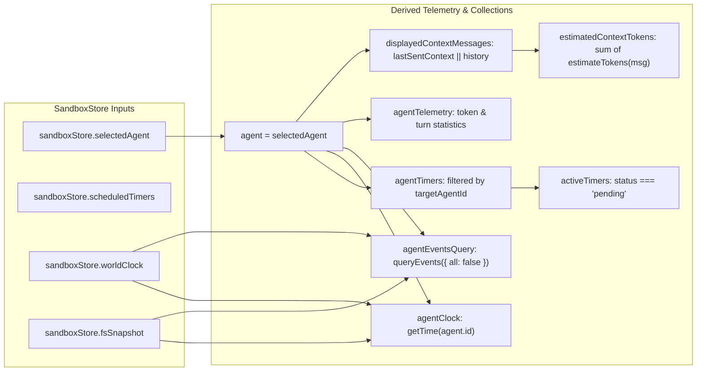
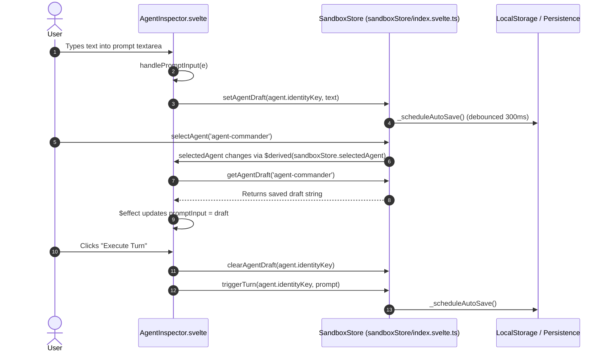
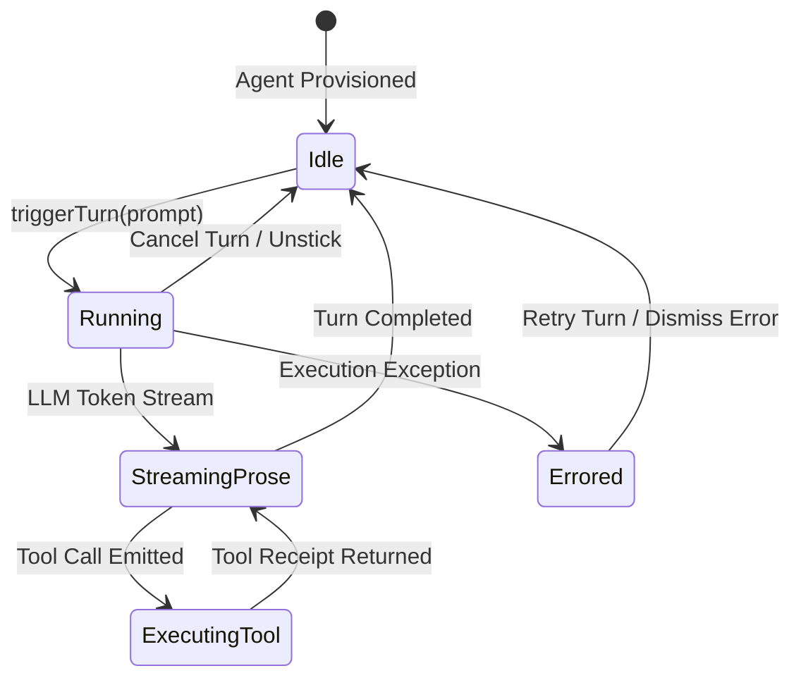
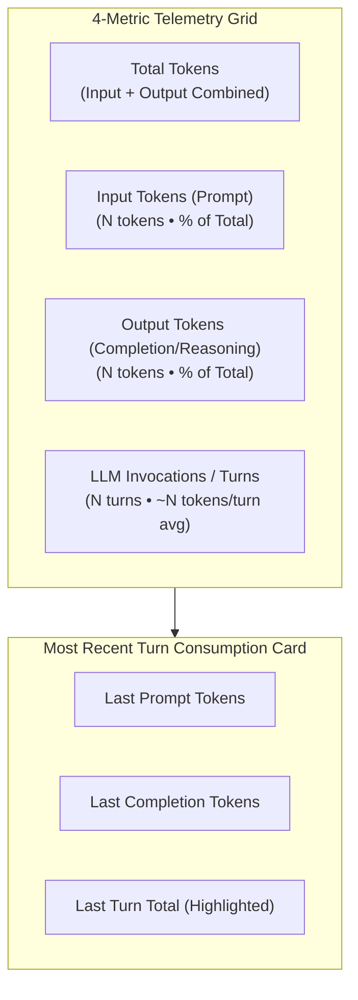

# Agent Inspector & Telemetry Trace Architecture

**Status:** CURRENT
**Last verified: 2026-09-24**

> [!NOTE]
> This document details the technical implementation, reactive state synchronization, and observability features of `AgentInspector.svelte` within the `ai-story` Studio UI.

---

## 1. Component Overview

`AgentInspector.svelte` provides an in-depth observability, debugging, and live manual interaction surface for the currently focused agent instance. It offers:

1. **Live Cognitive & Prose Trace**: Real-time streaming markdown, thinking token accordions, and active tool call visualizations.
2. **Scheduled Timers & Narrative Clock Controls**: Live deferred countdown timers, WorldClock narrative time tracking, and event registry inspection.
3. **Turn Execution & History Scrubbing**: Manual directive submission, per-agent draft synchronization, quick suggestion chips, undo/redo turn scrubbing, and raw JSON payload toggles.
4. **Token Telemetry Grid**: Cumulative input/output token consumption metrics, percentage splits, per-turn averages, and last-turn breakdowns.
5. **Sent Context Inspector**: Exact formatted message context arrays dispatched to model APIs with token estimations per message.
6. **Recovery & Failure Diagnostics**: A dismissible session-recovery notice when persisted state could not be loaded, plus a live execution-error banner with Retry Turn / Undo Turn & Edit Prompt / Dismiss actions.

The header **Model** / **Thinking** / **Provider** / **Temp** chips resolve from the agent's bound catalog preset through the shared `agentModelConfigHelpers.resolveAgentModelConfig` (falling back to `agent.config.modelConfig`, then the active-preset projection `sandboxStore.modelConfig`); the turn path independently materializes the same preset config at turn start (`materializeEffectiveModel`), so the chips are display-only.

```mermaid
flowchart TD
    subgraph InspectorRoot ["AgentInspector.svelte"]
        RecoveryNotice["Session Recovery Notice (.hydration-notice-banner)\n('Session Recovery' title | Dismiss)"]
        Header["Inspector Header & Metadata Banner\n(Authority, Tools Whitelist, Model, Thinking, Provider, Turns, Mailbox, Temp, Max Calls)"]
        StateBanner["Lifecycle State Banner\n(RUNNING / IDLE / ERRORED + State Detail)"]
        ErrorBanner["Diagnostic Error Banner\n(Retry Turn | Undo Turn & Edit Prompt | Dismiss)"]
        
        NavTabs["Inspector Tab Bar: [Trace & Interaction] | [Telemetry & Tokens] | [Sent Context (Debug)]"]
        
        subgraph TabTrace ["Tab: Trace & Interaction"]
            LiveStream["Live Streaming Prose Card (Typing Cursor)"]
            ThinkingCard["Reasoning / Thinking Tokens Accordion"]
            ActiveTools["Active Tool Invocations Card"]
            ScheduledTimers["Scheduled Deferred Timers (Live Countdowns & Quick Schedule)"]
            NarrativeClock["Narrative Time & Events (00:00:00, Events List, Reset Actions)"]
            TurnControl["Manual Execution Drawer (Draft Sync, Undo/Redo, Quick Prompts)"]
            TimelineFeed["Chronological History Timeline (Role Pills, Raw JSON, Tool Results)"]
        end

        subgraph TabTelemetry ["Tab: Telemetry & Tokens"]
            TelHeader["Telemetry Summary & Clear Action"]
            MetricsGrid["4-Metric Grid: Total Tokens | Input (Prompt) | Output (Completion) | Invocations"]
            LastTurn["Most Recent Turn Consumption (Prompt vs Completion)"]
        end

        subgraph TabContext ["Tab: Sent Context (Debug)"]
            ContextMeta["Context Summary: Message Count & Total Estimated Tokens"]
            ContextList["Message Items List: Role, ID, Token Estimate, Content Previews"]
            CopyContext["Copy Context JSON to Clipboard"]
        end
    end

    RecoveryNotice --> Header
    Header --> StateBanner
    StateBanner --> ErrorBanner
    ErrorBanner --> NavTabs
    NavTabs -->|inspectorTab === 'trace'| TabTrace
    NavTabs -->|inspectorTab === 'telemetry'| TabTelemetry
    NavTabs -->|inspectorTab === 'context'| TabContext
```

---

## 2. Component Props & Reactive State Architecture

### 2.1 Component Props (`$props()`)

| Prop Name | Type | Default | Description |
| :--- | :--- | :--- | :--- |
| `onEditAgent` | `Function` | `() => {}` | Callback invoked when the user clicks **Edit Agent** in the header banner. |

### 2.2 Local State Variables (`$state()`)

| State Variable | Type | Default | Description |
| :--- | :--- | :--- | :--- |
| `promptInput` | `string` | `''` | Text bound to the manual execution textarea; synced with per-agent draft storage. |
| `isExecuting` | `boolean` | `false` | True while a manual turn execution is in-flight. |
| `localError` | `string` | `''` | Error message captured during manual turn execution. |
| `isThinkingExpanded` | `boolean` | `true` | Collapsible state of the live reasoning / thinking box. |
| `showHistoryDetails` | `Record<number, boolean>` | `{}` | Map of history timeline indices toggled to display raw JSON. |
| `inspectorTab` | `'trace' \| 'telemetry' \| 'context'` | `'trace'` | Active sub-tab within the Inspector. |
| `copyStatusText` | `string` | `''` | Temporary feedback string (`'Copied!'` / `'Failed'`) for context clipboard operations. |
| `newTimerDuration` | `number` | `10` | Duration in seconds for scheduling a new one-shot timer. |
| `newTimerPrompt` | `string` | `''` | Reminder prompt string delivered when a scheduled timer fires. |
| `isSchedulingTimer` | `boolean` | `false` | Form submission state while dispatching a timer creation. |
| `timerError` | `string` | `''` | Validation or scheduling error message. |
| `isResettingEvents` | `boolean` | `false` | True while narrative simulation events are being purged. |
| `isResettingClock` | `boolean` | `false` | True while the narrative WorldClock is being reset to Day 1. |
| `eventsError` | `string` | `''` | Diagnostic error message during WorldClock operations. |

### 2.3 Derived Computations (`$derived` / `$derived.by()`)

---

## 3. Per-Agent Draft Input Synchronization

The Inspector integrates a two-way reactive draft synchronization pattern. When switching between agents, unsubmitted textarea text is never lost; it is preserved in `sandboxStore.agentDraftInputs` and restored via an `$effect()` hook.

---

## 4. Sub-Tab Specifications

### 4.1 Tab 1: Trace & Interaction

The primary diagnostic and orchestration interface for the selected agent:

1. **Live Streaming Prose Card**: Rendered when `agent.state === 'running'` or `agent.currentStream` contains active tokens. Uses `renderMarkdownProse()`, displays total character length, and renders an animated gold typing cursor (`.typing-cursor`).
2. **Reasoning / Thinking Tokens Box**: Displayed when `agent.currentReasoning` is non-empty. Features an animated shimmer spark icon, character stream, and auto-collapsing toggle.
3. **Active Tool Calls Card**: Real-time display of tool invocations currently executing in runtime, formatting arguments with `formatJson()`.
4. **Scheduled Deferred Timers**:
   - Status indicators for `pending`, `cancelled`, and `triggered` states.
   - Live countdown badge: `⏳ Ns remaining`.
   - Cancellation action triggering `sandboxStore.cancelScheduledTimer(timerId)`.
   - Quick schedule form with duration (1–3600s) and reminder prompt input.
5. **Narrative World Clock & Events**:
   - Time banner: Formatted simulation clock (`00:00:00`), narrative date (`Day 1`), and total elapsed seconds.
   - Active narrative events list with trigger timestamps, status pills (`active`, `pending`, `completed`), and priority flags.
   - Reset actions for event registries and clock partitions.
6. **Manual Execution Drawer**:
   - Prompt input textarea supporting multi-line instructions.
   - Suggestions: `List Files`, `Check Inbox`, `Post Status`.
   - **Undo Turn** (removes last turn, restores prompt to draft) and **Redo Turn** (with redo stack count badge).
   - **Cancel Turn** button for running turns and **Execute Turn** for idle agents.
7. **Chronological History Timeline**:
   - Keyed feed of historical turns with role badges (`user`, `assistant`, `tool`, `system`).
   - `Raw JSON` toggle per turn for deep inspection.
   - Markdown prose parsing and tool call execution summaries.

---

### 4.2 Tab 2: Telemetry & Token Consumption

The Telemetry tab provides a granular breakdown of resource usage for the agent instance.

- **Clear Telemetry**: Invokes `sandboxStore.clearAgentTelemetry(agent.id)`, resetting cumulative token counters and turn counts to zero.

---

### 4.3 Tab 3: Sent Context Payload (Debug)

The Sent Context tab exposes the exact formatted message array transmitted to the LLM completion endpoint on the most recent turn.

- **Message Array View**: Indexed entries (`#1`, `#2`, ...) with role pills (`user`, `assistant`, `system`, `tool`), tool call IDs, and estimated prompt token counts calculated via `estimateTokens()`.
- **Copy JSON Action**: Copies the serialized JSON array to the system clipboard, providing a temporary `'Copied!'` confirmation badge.
- **Context Meta Bar**: Displays total message count and aggregate estimated prompt tokens.

---

## 5. Failure & Recovery Surfaces

### 5.1 Session Recovery Notice

When persisted sandbox state cannot be fully loaded, the store raises a dismissible `hydrationNotice` (`{ message, at, reason }`, `sandboxStore/index.svelte.ts`) instead of failing silently. The Inspector renders it as the first element of its container:

- **`.hydration-notice-banner`** with `role="alert"`, a warning icon, the fixed title **Session Recovery**, the notice message (for example *"Saved session could not be loaded — starting fresh"*), and a dismiss button wired to `sandboxStore.dismissHydrationNotice()`.
- **`reason`** is one of `unparseable`, `invalid-schema`, `unreadable`, or `hydration-failed` (a critical subsystem rejected its snapshot while the store mirrored the partially hydrated engine).

Studio renders exactly one tab component at a time (`SandboxView`): the recovery notice is only present in the DOM while the **Telemetry & Trace** tab is active, and switching to Chat Studio (or any other tab) unmounts it. It is **not** a shell-wide banner.

### 5.2 Execution Error Banner

The Inspector header renders the agent's failure diagnostic as **`.error-banner`** (`role="alert"`, title **Execution Error Encountered**) while `agent.lastError` or the Inspector's local `localError` is set:

- **Retry Turn** clears the local error and calls `sandboxStore.retryAgentTurn(agent.id)` to re-run the failed turn.
- **Undo Turn & Edit Prompt** calls `sandboxStore.undoAgentTurn(agent.id)`, reverting the failed turn and restoring the prompt to the editor.
- **Dismiss** clears `localError` and the agent's diagnostic via `sandboxStore.clearAgentLastError(agent.id)`, without mutating conversational history.

`agent.lastError` is a redacted diagnostic **string** produced at the store boundary; the banner reflects the agent's live error condition.

Two other surfaces carry the same **Execution Error Encountered** title and the same three actions, each rendered by its host: the in-transcript `.sandbox-failure-card` in the Chat Studio message stream (see [Chat Studio & Message Cards §4.5](./chat_and_message_cards.md#45-failure--interrupted-turn-notices)) and the action dock's `.failure-notice-banner` (see [Modals & Dialogs §5](./modals_and_dialogs.md#5-bottom-action-dock-sandboxactioninputsvelte)). Each notice is owned by its host component and renders only inside it; in the Chat Studio pane the transcript card takes precedence over the dock banner (see the suppression note in [Chat Studio & Message Cards §4.5](./chat_and_message_cards.md#45-failure--interrupted-turn-notices)).

---

## 6. Telemetry & Context Metrics Table

| Metric Field | Source | Description |
| :--- | :--- | :--- |
| `inputTokens` | `agent.telemetry.inputTokens` | Cumulative tokens processed in prompts for this agent instance. |
| `outputTokens` | `agent.telemetry.outputTokens` | Cumulative completion and reasoning tokens generated. |
| `totalTokens` | `agent.telemetry.totalTokens` | Sum of `inputTokens` and `outputTokens`. |
| `turnCount` | `agent.telemetry.turnCount` | Total LLM turn invocations executed by the agent. |
| `lastPromptTokens` | `agent.telemetry.lastPromptTokens` | Prompt tokens consumed on the most recent API call. |
| `lastCompletionTokens` | `agent.telemetry.lastCompletionTokens` | Completion tokens generated on the most recent API call. |
| `lastSentContext` | `agent.telemetry.lastSentContext` | Snapshot of the exact prompt array sent to the model API. |
| `estimatedContextTokens` | Derived Calculation | Sum of estimated tokens across all messages in `lastSentContext`. |

---

## 7. Sibling Documentation Links

- [Studio Architecture Overview](./studio_overview.md) - Svelte 5 runes and workstation layout.
- [VirtualFS Explorer Specifications](./virtualfs_explorer.md) - Filesystem navigation and archive tools.
- [Chat Studio & Message Cards](./chat_and_message_cards.md) - Chat rendering and streaming prose.
- [Messaging Bus Viewer](./messaging_bus_viewer.md) - Inter-agent communication traces.
- [Modals & Dialogs Architecture](./modals_and_dialogs.md) - Agent configuration modals.
