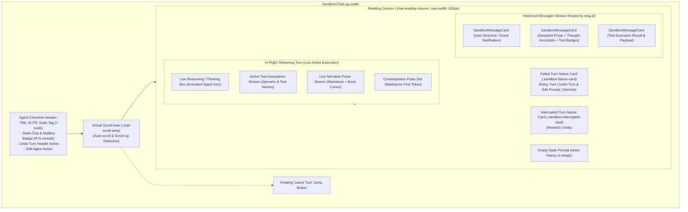
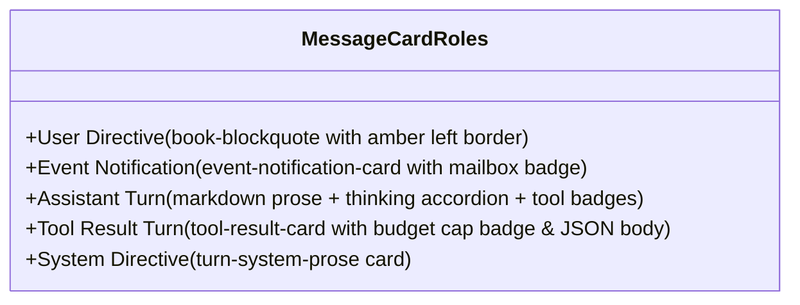
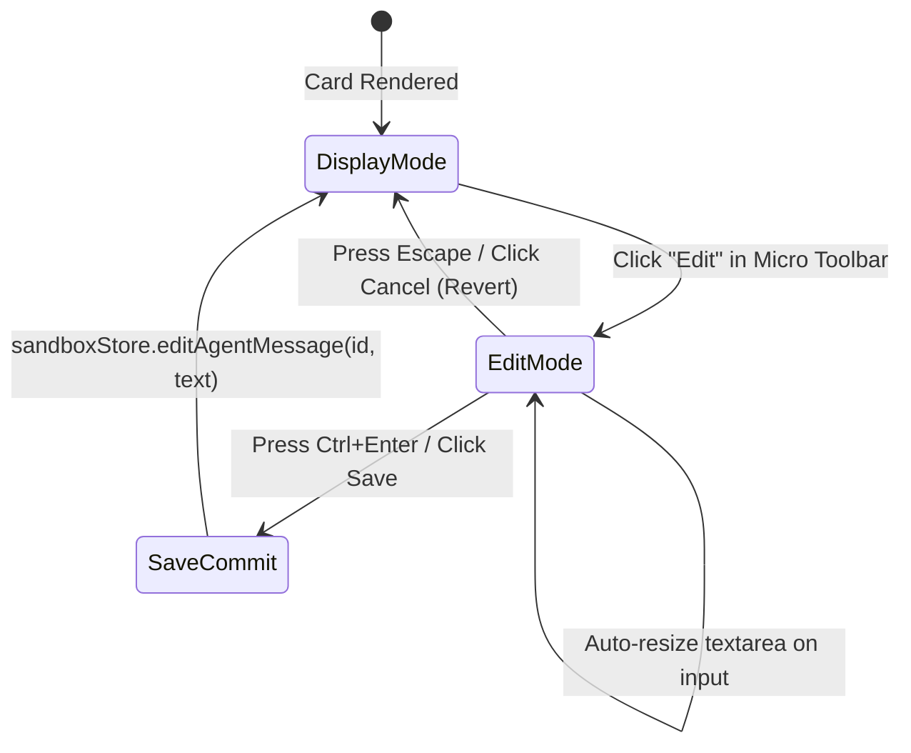

# Chat Studio & Message Cards Architecture

**Status:** CURRENT
**Last verified: 2026-09-22**

> [!NOTE]
> This document specifies the implementation of `SandboxChatLog.svelte` and `SandboxMessageCard.svelte` in the `ai-story` Studio UI, covering token streaming rendering, cognitive reasoning accordions, tool call visualization, deterministic yielding, inline editing, and auto-scroll mechanics.

---

## 1. Architectural Overview

The **Chat Studio** provides a conversational interface for directing individual agents. It renders historical and live streaming turns with layout-stable transitions — a deterministic yielding check removes the live preview once the committed message lands (see §3) — plus real-time tool execution monitoring.



---

## 2. Component Properties & State

### 2.1 `SandboxChatLog.svelte` Props & State

#### Props (`$props()`)
| Prop Name | Type | Default | Description |
| :--- | :--- | :--- | :--- |
| `agent` | `AgentInstance \| null` | `null` | Active agent object from `sandboxStore.selectedAgent`. |
| `messages` | `Array<HistoryMessage>` | `[]` | Chronological conversation history for the agent. |
| `isStreaming` | `boolean` | `false` | True when the agent is generating tokens or executing tools. |
| `streamingProse` | `string` | `''` | In-flight prose token buffer. |
| `streamingReasoning` | `string` | `''` | In-flight reasoning / thinking token buffer. |
| `activeToolCalls` | `Array<ToolCall>` | `[]` | Array of tool calls currently executing in runtime. |
| `onSendTurn` | `Function` | `async () => {}`| Callback for submitting user directives. |
| `onEditMessage` | `Function \| null` | `null` | Callback for updating historical message text. |
| `onEditAgent` | `Function \| null` | `null` | Callback for opening the agent customization modal. |

#### Local State (`$state()`)
| State Variable | Type | Default | Description |
| :--- | :--- | :--- | :--- |
| `scrollContainer` | `HTMLElement \| null` | `null` | DOM reference to the scrollable container element. |
| `lastScrollTop` | `number` | `0` | Last observed `scrollTop` value, updated by `handleScroll()`. |
| `isUserScrolledUp` | `boolean` | `false` | True when user has scrolled up by > 100px from the bottom. |
| `isStreamingThinkingExpanded` | `boolean` | `false` | Collapsible state of the live thinking box during streaming. |

---

### 2.2 `SandboxMessageCard.svelte` Props & State

#### Props (`$props()`)
| Prop Name | Type | Default | Description |
| :--- | :--- | :--- | :--- |
| `message` | `HistoryMessage` | *Required* | Message object containing `id`, `role`, `content`, `reasoning`, `tool_calls`. |
| `isLatest` | `boolean` | `false` | True if this is the final message in history. |
| `isLatestAssistant` | `boolean` | `false` | True if this is the latest assistant turn in history. |
| `isStreaming` | `boolean` | `false` | Streaming state indicator. |
| `agentId` | `string \| null` | `null` | Target agent identifier for dispatching mutations. |
| `onEditMessage` | `Function \| null` | `null` | Callback invoked when an inline edit is saved. |
| `onDeleteMessage` | `Function \| null` | `null` | Callback invoked when a message is deleted. |
| `onUndoTurn` | `Function \| null` | `null` | Callback invoked when an undo turn is triggered. |

#### Local State (`$state()`)
| State Variable | Type | Default | Description |
| :--- | :--- | :--- | :--- |
| `isThinkingExpanded` | `boolean` | `false` | Toggle state for historical thought process accordion. |
| `copied` | `boolean` | `false` | Temporary flag confirming message copy to clipboard. |
| `showToolDetails` | `Record<string, boolean>` | `{}` | Map of tool call IDs toggled to display arguments or JSON. |
| `isEditing` | `boolean` | `false` | Toggles inline editing mode for the message. |
| `editDraft` | `string` | `''` | Text buffer for in-place message editing. |
| `isSaving` | `boolean` | `false` | Submission state while saving an inline edit. |
| `editTextareaRef` | `HTMLElement \| null`| `null` | DOM reference to the inline edit textarea. |

---

## 3. Streaming Lifecycle & Deterministic Yielding

To prevent visual artifacts and duplicate message bubbles when a streaming turn completes, the Chat Studio implements a **Deterministic Yielding Check**:

```mermaid
sequenceDiagram
    autonumber
    actor User
    participant ActionInput as SandboxActionInput.svelte
    participant Store as SandboxStore
    participant Runtime as AgentRuntime
    participant ChatLog as SandboxChatLog.svelte
    participant MessageCard as SandboxMessageCard.svelte

    User->>ActionInput: Submits directive ("Analyze sensor logs")
    ActionInput->>Store: submitChatTurn(text)
    Store->>Runtime: executeAgentTurn()
    Runtime-->>Store: stream_chunk (prose / reasoning)
    Store-->>ChatLog: isStreaming=true, streamingProse="Found anomaly..."
    ChatLog->>ChatLog: Renders Live Streaming Turn block

    Runtime->>Runtime: Turn completes; appends assistant message to agent.history
    Runtime-->>Store: agent_idle / turn_complete
    Store-->>ChatLog: messages updated with new assistant message (id: "msg_123")
    ChatLog->>ChatLog: hasCommittedCurrentTurn(messages, streamingProse) returns TRUE
    ChatLog->>ChatLog: Immediately unmounts Live Streaming Turn preview
    ChatLog->>MessageCard: Renders committed message "msg_123" (live preview already unmounted)
```

### Deterministic Yielding Logic
```javascript
function hasCommittedCurrentTurn(msgs, streamProse) {
  if (!msgs || msgs.length === 0) return false;
  const lastMsg = msgs[msgs.length - 1];
  if (lastMsg && (lastMsg.role === 'assistant' || lastMsg.role === 'model')) {
    const trimmedStream = (streamProse || '').trim();
    const trimmedContent = (lastMsg.content || '').trim();
    if (trimmedStream && trimmedContent && 
       (trimmedStream === trimmedContent || trimmedContent.endsWith(trimmedStream))) {
      return true;
    }
  }
  return false;
}
```

---

## 4. Message Card Types & Visual Hierarchies

`SandboxMessageCard.svelte` renders distinct visual presentations based on the message `role` and payload structure:



### 4.1 1. User Directive Turn
- **Standard Directive**: Rendered inside a `.book-blockquote` featuring an amber border (`--accent-primary: #d4af37`), distinct background tint, and serif typography.
- **Event Notification (`[EVENT NOTIFICATION]` / `[MAIL NOTIFICATION]`)**:
  - Rendered in a specialized card with an amber border.
  - Features an icon (`🕒` for scheduled events, `✉️` for mailboxes).
  - Displays a **Mailbox Autonomy** badge and monospaced notification text.

### 4.2 2. Assistant Turn
- **Claude-Style Thinking Accordion**:
  - Displayed when `reasoning` or `reasoning_content` is present.
  - Animated spark icon (`.thinking-spark-svg.animating`) with shimmer rotation.
  - Monospaced reasoning trace with collapsible header.
- **Inline Compact Tool Badges**:
  - Rendered for tool invocations emitted by the assistant (`message.tool_calls`).
  - Status checkmark (`✓`), tool name, tool call ID snippet (`id: 1234abcd`).
  - Expandable arguments inspector showing formatted JSON.
- **Rich Narrative Prose**:
  - Rendered via `renderMarkdownProse()` supporting headers, code blocks, bold/italics, and ordered/unordered lists.

### 4.3 3. Tool Result Turn
- **Status Indicator**: Green checkmark (`✓`) for successful executions, red cross (`✕`) for errors (`parsed.success === false`).
- **Tool Header**: Displays tool name (`message.name`), tool call ID, and **1.5KB Capped** badge if the output exceeded the token budget.
- **Concise Summary Line**: Displays short receipts (e.g. `"/mission_report.json (240 bytes)"` or `"5 matches found"`) when collapsed.
- **Expandable Raw JSON Body**: Monospaced formatted payload with syntax highlighting.

### 4.4 4. System Directive Turn
- Encapsulated in a subtle glass panel with an info icon and monospaced directive text.
- The directive body (`.system-body p`) renders with `white-space: pre-wrap` and `overflow-wrap: anywhere` (ticket 4154694): multi-line system prompts keep their line breaks, blank lines, and indentation exactly like the inline editor's textarea and the Sent Context view, while a long single line wraps without horizontal overflow. The stored/sent prompt was never affected — display only.

### 4.5 Failure & Interrupted Turn Notices

Two notice cards render in the transcript below the message stream; they are mutually exclusive and neither renders while the agent is streaming.

- **Failed Turn Notice (`.sandbox-failure-card`, `role="alert"`)** — shown while the selected agent carries a diagnostic error (`failureReason` derived from `agent.lastError`). The card title is **Execution Error Encountered** and the body shows the redacted diagnostic reason, with:
  - **Retry Turn** → `sandboxStore.retryAgentTurn(agent.id)`;
  - **Undo Turn & Edit Prompt** → `sandboxStore.undoAgentTurn(agent.id)`;
  - **Dismiss** → `sandboxStore.clearAgentLastError(agent.id)`.

  The action dock's `.failure-notice-banner` mirrors the same reason and actions. Within the Chat Studio pane the transcript card is canonical: a CSS rule scoped to `.chat-studio-pane` hides the dock banner while the card renders, so exactly one failure notice is visible in the pane; the dock keeps its composer action buttons and hotkey hints. Outside that pane the dock banner is the surface (see [Modals & Dialogs §5](./modals_and_dialogs.md#5-bottom-action-dock-sandboxactioninputsvelte)).

- **Interrupted Turn Notice (`.sandbox-interrupted-card`)** — shown for a genuine cancellation (no failure reason and `sandboxStore.isAgentInterrupted(agent.id)`), titled **Agent Turn Interrupted** with **Resend** and **Undo** actions. The dock's `.interrupted-notice-banner` mirror is suppressed inside the chat pane the same way.

---

## 5. Inline Message Editing (REQ-UI-04)

Users can edit historical user directives, assistant prose, or system instructions in-place:



1. Hovering or focusing a message reveals the **Micro Toolbar**.
2. Clicking **Edit** mounts an inline `.inline-edit-textarea` prefilled with current content.
3. Supports `Ctrl+Enter` to save, `Escape` to cancel, and automatic height adjustment (`autoResizeEdit()`).
4. Updates are dispatched to `sandboxStore.editAgentMessage(messageId, newContent)` and persisted.

---

## 6. Virtual Scrolling & Auto-Scroll Mechanics

The scroll container maintains strict scroll-lock behavior:

- **Auto-Scroll on Stream**: An `$effect()` hook reads `messages.length`, `streamingProse`, `streamingReasoning`, and `isStreaming`. If `isUserScrolledUp === false`, it queues `scrollToBottom(true)` inside `queueMicrotask()`.
- **User Scroll-Up Detection**: The `onscroll` listener evaluates:
  $$\text{distanceFromBottom} = \text{scrollHeight} - (\text{scrollTop} + \text{clientHeight})$$
  If $\text{distanceFromBottom} > 100\text{px}$, `isUserScrolledUp` is set to `true`, preventing auto-scroll from interrupting reading.
- **Floating Jump Button**: When `isUserScrolledUp` is true, a floating **"Latest Turn"** button appears, allowing immediate return to the bottom.

---

## 7. Actions & Keyboard Shortcuts Table

| Trigger | Target | Action |
| :--- | :--- | :--- |
| `Hover / Focus` | `SandboxMessageCard` | Displays Micro Toolbar (Edit, Copy, Delete, Undo). |
| `Click Copy` | Micro Toolbar | Copies message content to clipboard with confirmation. |
| `Click Delete` | Micro Toolbar | Deletes message with cascading tool hygiene. |
| `Click Undo Turn` | Micro Toolbar / Header | Reverts the last turn and restores prompt text. |
| `Ctrl + Enter` | Inline Editor | Commits and saves message edit. |
| `Escape` | Inline Editor | Cancels inline message edit. |
| `Click Latest Turn` | Floating Button | Smoothly scrolls to the bottom of the conversation. |

---

## 8. Sibling Documentation Links

- [Studio Architecture Overview](./studio_overview.md) - Workstation layout and runes.
- [Agent Inspector Architecture](./agent_inspector.md) - Telemetry and cognitive trace.
- [VirtualFS Explorer Specifications](./virtualfs_explorer.md) - Filesystem management.
- [Messaging Bus Viewer](./messaging_bus_viewer.md) - Real-time pub/sub monitoring.
- [Modals & Dialogs Architecture](./modals_and_dialogs.md) - Action inputs and modal workflows.
