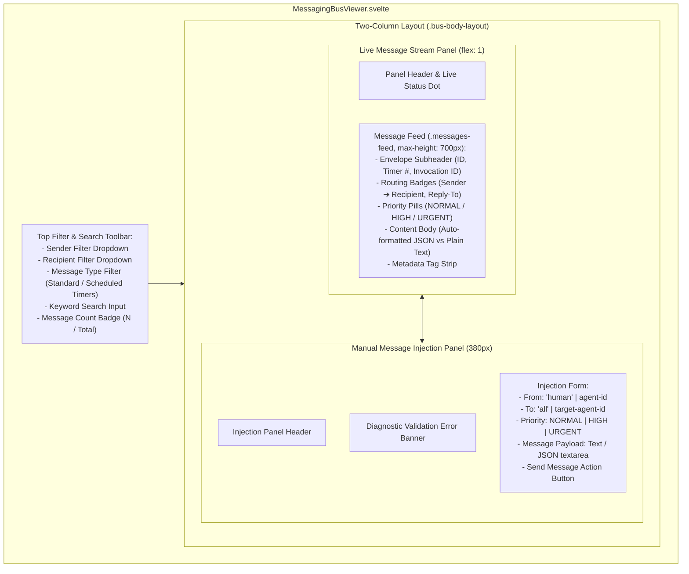
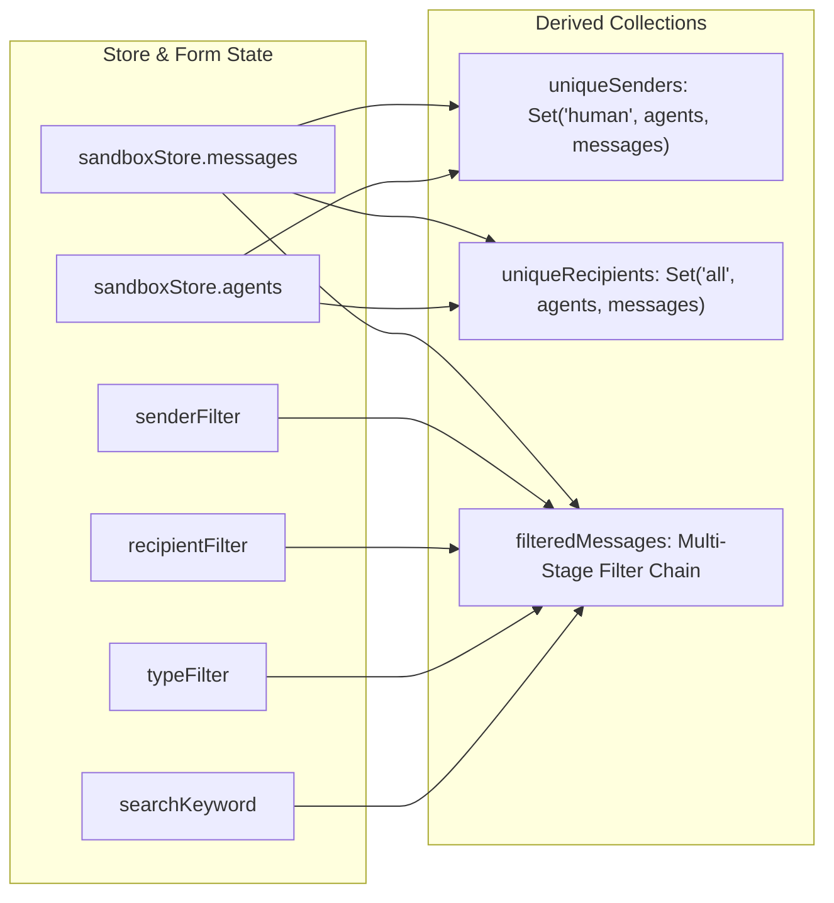
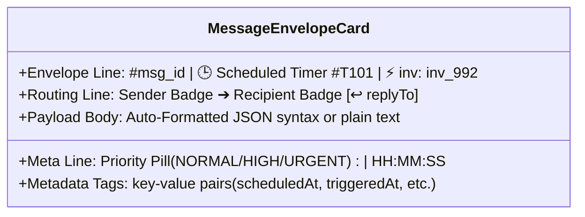

# Messaging Bus Viewer & Inter-Agent Audit Trace

**Status:** CURRENT
**Last verified: 2026-09-20**

> [!NOTE]
> This document specifies the implementation of `MessagingBusViewer.svelte`, covering pub/sub routing, mailbox monitoring, broadcast auditing, event filtering, and manual message injection.

---

## 1. Architectural Overview

The **Messaging Bus Viewer** provides an observability and debugging tool for all inter-agent communication, broadcast events, scheduled timer deliveries, and human-in-the-loop directives flowing through the `MessagingBus` (Layer 2).



---

## 2. Reactive State & Filtering Pipeline

The component consumes `sandboxStore.messages` and `sandboxStore.agents`, calculating real-time filtered views using Svelte 5 `$derived.by()` runes.



### 2.1 Local State Variables (`$state()`)

| State Variable | Type | Default | Description |
| :--- | :--- | :--- | :--- |
| `senderFilter` | `string` | `''` | Filters message stream by exact `from` address. |
| `recipientFilter` | `string` | `''` | Filters message stream by exact `to` address (`all` or agent ID). |
| `typeFilter` | `string` | `''` | Filters by category (`'standard'` vs `'scheduled_timer'`), checking `m.type`, `m.metadata.category`, and `m.metadata.type`. |
| `searchKeyword` | `string` | `''` | Substring search across content, sender, and recipient. |
| `autoScroll` | `boolean` | `true` | Scroll-lock state for the message feed. |
| `msgFrom` | `string` | `'human'` | Form input: Sender identifier for manual injection. Operator presentation labels (default `'human'`; any non-agent label) are attributed to the operator subject (`director`) in the delivered envelope, so Realm-scoped delivery treats manual sends as operator traffic; agent-id labels keep the agent's own identity and scope. |
| `msgTo` | `string` | `'all'` | Form input: Destination address for manual injection. |
| `msgContent` | `string` | `''` | Form input: Payload string (text or JSON) for injection. |
| `msgPriority` | `'NORMAL' \| 'HIGH' \| 'URGENT'` | `'NORMAL'` | Form input: Priority level header. |
| `sendError` | `string` | `''` | Validation or delivery error message. |

---

## 3. Message Envelope Anatomy & Visual Hierarchy

Each card in the message feed represents an individual communication envelope:



```
+-------------------------------------------------------------------------+
| #msg_94821a   🕒 Scheduled Timer #104   ⚡ inv: inv_398a                 | <- Envelope Line
+-------------------------------------------------------------------------+
| [ agent-scout ] ──────➔ [ agent-commander ]    [ ↩ agent-scout ]       | <- Routing Badges
|                                              [ HIGH ]  14:32:05         | <- Priority & Time
+-------------------------------------------------------------------------+
| Reconnaissance completed in Sector 7. Directives stored in global      | <- Content Body
| /mission_report.json. Awaiting authorization code.                      |
+-------------------------------------------------------------------------+
| reportPath: /mission_report.json | sector: Quadrant 7                   | <- Metadata Tags
+-------------------------------------------------------------------------+
```

### 3.1 Card Styling Rules
1. **Broadcast Messages (`to === 'all'`)**: Left accent border in warm bronze (`--accent-primary: #d4af37`), recipient badge styled in gold.
2. **Scheduled Timer Events (`type === 'scheduled_timer'`)**: Left accent border in amber (`#f59e0b`), subtle gradient background, and sender badge styled as `⏱️ system:scheduler`.
3. **Point-to-Point Messages**: Cyan sender badge (`--accent-cyan: #38bdf8`), neutral background.

---

## 4. Manual Message Injection Engine

The injection form enables human operators to send arbitrary directives, simulate system events, or test inter-agent triggers:

```mermaid
sequenceDiagram
    autonumber
    actor Operator
    participant UI as MessagingBusViewer.svelte
    participant Store as SandboxStore
    participant Bus as MessagingBus (messagingBus/)
    participant Agent as AgentInstance (agent-scout)

    Operator->>UI: Fills Form (From: "human", To: "agent-scout", Priority: "HIGH")
    Operator->>UI: Submits Payload ("Abort current mission immediately")
    UI->>Store: sendMessage("human", "agent-scout", content, { priority: "HIGH" })
    Note over Store: Operator label mapped to the operator subject; Realm scope resolves as the director (bypass)
    Store->>Bus: sendMessage({ from: "director", to, content, metadata })
    Bus->>Bus: Appends message to global log and agent-scout's inbox
    Bus->>Agent: Increments unreadCount (✉ 1)
    Bus-->>Store: syncMessages() & syncAgents()
    Store-->>UI: Refreshes Live Message Feed
    Store->>Store: _scheduleAutoSave() (debounced 300ms)
```

### Injection Validation Rules
- **Non-Empty Payload**: `msgContent.trim()` must contain at least one character.
- **Recipient Must Be Registered**: direct (non-`all`) recipients known to be unregistered or terminated are rejected with `RECIPIENT_NOT_FOUND` / `AGENT_TERMINATED`; mailboxes are not auto-created.
- **JSON Formatting**: Text enclosed in `{...}` or `[...]` is validated and formatted via `formatJsonPayload()`.

---

## 5. Event Filtering Matrix

| Filter Type | Expression / Logic | Resulting Stream |
| :--- | :--- | :--- |
| **All Senders** | `senderFilter === ''` | Shows messages from all senders. |
| **Specific Sender** | `m.from === senderFilter` | Shows only messages originated by the selected entity. |
| **All Recipients** | `recipientFilter === ''` | Shows all destinations. |
| **Broadcast Only** | `recipientFilter === 'all'` | Shows only messages addressed to `all`. |
| **Standard Type** | `typeFilter === 'standard'` | Filters out timer events (`m.type`, `m.metadata.category`, and `m.metadata.type` all differ from `'scheduled_timer'`). |
| **Timer Events** | `typeFilter === 'scheduled_timer'`| Shows timer deliveries where `m.type === 'scheduled_timer'` or `m.metadata.category / m.metadata.type === 'scheduled_timer'` (`system:scheduler`). |
| **Keyword Search** | Substring check | Matches text inside `content`, `from`, or `to` fields. |

---

## 6. Sibling Documentation Links

- [Studio Architecture Overview](./studio_overview.md) - Workstation layout and Svelte 5 runes.
- [Agent Inspector Architecture](./agent_inspector.md) - Telemetry, timers, and narrative clocks.
- [VirtualFS Explorer Specifications](./virtualfs_explorer.md) - Filesystem management.
- [Chat Studio & Message Cards](./chat_and_message_cards.md) - Conversational message stream.
- [Modals & Dialogs Architecture](./modals_and_dialogs.md) - Agent configuration modals.
