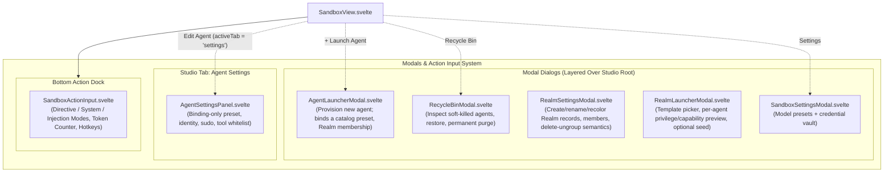
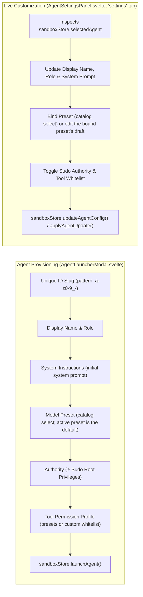
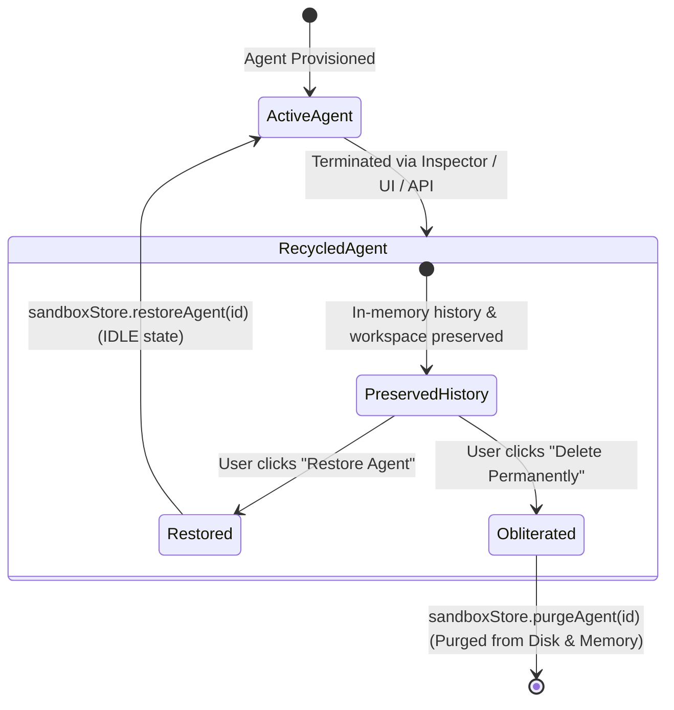
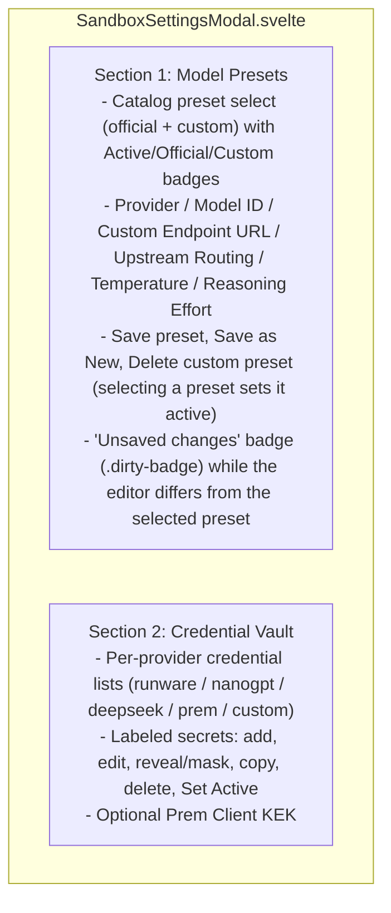

# Modals, Dialogs & Action Input Architecture

**Status:** CURRENT
**Last verified:** 2026-09-22

> [!NOTE]
> This document specifies the modal dialogs and action dock in the `ai-story` Studio UI: `AgentLauncherModal.svelte`, `RecycleBinModal.svelte`, `SandboxSettingsModal.svelte`, `AgentSettingsPanel.svelte` (the live-edit tab, not a modal), and `SandboxActionInput.svelte` — all under `src/lib/components/sandbox/`.

---

## 1. Architectural Overview

The Studio employs an accessible modal and input dock architecture for provisioning agents, managing soft-killed instances, editing catalog model presets and provider credentials, and dispatching multi-mode turns. Live per-agent customization is not a modal: it is the **Agent Settings** tab (`AgentSettingsPanel.svelte`).

---

## 2. Agent Provisioning & Configuration

### 2.1 `AgentLauncherModal.svelte` vs `AgentSettingsPanel.svelte`

Provisioning and live customization are split between a modal and a Studio tab. Model identity is **binding-only**: every agent binds to one catalog preset by `presetId` and resolves its effective `modelConfig` from that preset. There is no per-agent model override, no `'inherit'` sentinel, and no per-agent credential field.

**Edit Agent flow:** the Chat Studio header action and Inspector `onEditAgent` callback set `sandboxStore.setActiveTab('settings')`, which renders `AgentSettingsPanel` in the tab viewport.

`AgentSettingsPanel.svelte` semantics:

- **Binding-only model editing**: the panel selects one catalogue preset (`agent.config.presetId`); if the bound id no longer resolves, it falls back to the active preset. Selecting a catalog preset binds it to the agent and sets the catalog's active preset pointer immediately. Editing the bound preset writes through the preset catalog — it is never a per-agent override.
- **Live apply**: identity, prompt, and preset fields dispatch per-field updates to the agent runtime as they are edited; free-text fields are debounced (~300 ms) and each field reports its own applying / saved / error feedback. The header's **Live apply** badge (`.live-apply-badge`) marks the panel as continuously applied — there is no Save button for agent fields.
- **Applied preset changes**: the bound-preset editor compares the draft against the seeded preset and shows an **UNSAVED** pill (`.dirty-pill`) while they differ. Saving writes the preset through the catalog; because agents bind by `presetId`, an edited preset reaches every bound agent at its **next turn start**, where the runtime re-materializes the effective model (matching bindings are marked dirty on `preset-updated` and re-resolved once per turn).
- No per-agent temperature, base URL, API key, or service-tier fields; provider/model tuning belongs to the preset in `SandboxSettingsModal`.

### 2.2 Model & Inference Configuration Schema

The launcher shows a catalog preset select plus a resolved summary (provider, model, temperature, reasoning, optional routing/URL). Presets and per-vendor defaults come from the preset catalog (`src/lib/sandbox/presetCatalog/`) seeded from `PRESET_MODELS` / `getDefaultModelId()` (`sandbox/modelConfig/`).

| Configuration Field | Form Control | Default | Description |
| :--- | :--- | :--- | :--- |
| `presetId` | Catalog preset select | active preset | The single model binding; stored on `agent.config.presetId`. |
| `maxTurns` | Number input | `100000` | Loop step limit per turn execution. |
| `privileged` | Toggle | `false` | Sudo / administrative authority. |
| `allowedTools` | Preset select + custom text | `'all'` / `'*'` | Tool whitelist profile (see §2.3). |
| `realmId` | Realm select | Generic (`realm_generic`) | Realm membership at launch (operator context); membership is immutable after launch, and a Realm pruned while the modal is open falls back to Generic. |
| `systemPrompt` | Textarea | agent role text | Initial system directive. |

Model credentials are not part of the agent schema: agents resolve their key through the provider's active credential pointer in the global `CredentialVault` (`(keyId, secret)` pairs). Provider `url` for the `custom` vendor belongs to the preset's `modelConfig`, not the keystore.

### 2.3 Tool Permission Presets

| Preset Name | Identifier | Included Tool Whitelist |
| :--- | :--- | :--- |
| **Full Access (*)** | `'all'` | `['*']` (All virtual filesystem, messaging, scheduling, and runtime tools). |
| **Lead / Manager** | `'manager'` | Subagent management (`spawn_agent`, `invoke_agent`, `kill_agent`) + collaboration suite. |
| **Standard Collaborator** | `'collaborator'` | VirtualFS reading/writing, `send_message`, `schedule` deferred timers. |
| **Read-Only Collaborator** | `'readonly_collaborator'` | File reading, AST querying, line grep, `list_inbox`, and outbound messaging. |
| **Read-Only Observer** | `'readonly'` | Inspection, file reading, and mailbox querying only. Zero write tools. |
| **Custom Whitelist** | `'custom'` | Arbitrary comma-separated tool whitelist defined by operator. Blank/empty input is rejected with a validation error — it is never widened to `'*'`. Alias entries resolve to their canonical tool names. |

---

## 3. Agent Recycle Bin Modal (`RecycleBinModal.svelte`)

The Recycle Bin provides a soft-kill safety mechanism. Terminated agents preserve their complete conversation histories, memory state, and turn statistics.

### 3.1 Recycle Bin Actions
1. **Restore Agent**: Re-instates the agent into the active roster in `IDLE` state, restores unread counts, and focuses the agent in Studio.
2. **Delete Permanently**: Purges the agent from memory, private workspace partitions, and browser persistence.
3. **Empty Recycle Bin**: Batch purges all recycled instances in a single operation.

---

## 4. Realm Manager Modal (`RealmSettingsModal.svelte`)

Opened from the agent-drawer header (Realms button, with a count badge) or a Realm group's edit affordance. Manages `realmRegistry` records through the `sandboxStore` surface under the operator context.

| Capability | Behavior |
| :--- | :--- |
| Create / rename / recolor / describe | Operator-only store calls; duplicate ids refused; `id`/`createdAt` immutable; hex-only accent colors (invalid values fall back, never reach CSS). |
| Members list | Active + recycled members, read-only: Realm membership is immutable after launch — there are no “Move into Realm”/“Ungroup” affordances (terminate + relaunch into the target Realm instead). |
| Provenance | For template-launched Realms, a read-only panel shows `templateId`, the effective `templateVersion`, the optional hydration-package digest, and the launch timestamp from `RealmRecord.instance` (hashes only — never raw input values). Manual Realms show nothing. |
| Delete | Inline confirmation: deletion is refused while active or recycled members exist (“terminate or delete members first”); the operator-only recursive override purges active members, empties recycled ones, then removes the record (fail-closed report). The seeded Generic Realm is never deletable. |
| Validation | Store/orchestrator errors render in an inline error banner; Escape/backdrop/ARIA/focus-trap follow the modal conventions below. |

Sidebar grouping follows the same registry data: groups render in registry order (Generic first) with member counts and accent dots; the director renders pinned as a separate system-scope entity; there is no Ungrouped section (every non-director agent belongs to a Realm).

## 5. Realm Launcher Modal (`RealmLauncherModal.svelte`)

Two-step wizard for launching a Realm from a template — shipped with the app or imported into the runtime registry — and optionally seeding it. Entry points: the drawer-header rocket button and a “Launch from Template…” action inside the Realm manager (which closes first to avoid stacked dialogs).

| Step | Behavior |
| :--- | :--- |
| Configure & Preview | Template picker from the effective catalog (`sandboxStore.listRealmTemplates()`: shipped + imported, each labelled `shipped` / `imported` / `imported · replaces shipped` with its effective `sha256:` version). Registry controls: **Import…** (file → `importRealmTemplate`, typed errors surfaced), **Export** (canonical JSON download), **Delete Import…** (imported only; deleting restores the shipped revision). Review: generated inputs render as editable fields with a `generated` badge + hydration brief; per-agent rows show the **privilege badge**, wildcard source, declared preset, model-preset binding (resolved against the real catalog, with “active default” / “not in catalog” markers), expandable mutating/read-only grant groups from `summarizeAgentCapabilities`, a read-only baked-history preview, and the declared file slots (path, target, origin) — each slot openable in a provenance-marked files dialog with editable `user`/`generated` content and read-only `fixed` content. Declared per-agent authorities render as approval checkboxes with the trust control (§5.1). Name/color/description prefilled; launch calls `launchRealmFromTemplate` with progress and rollback-aware errors; the new Realm appears in the sidebar immediately. |
| Seed (optional) | File rows (path + content), target picker (Realm-global default, or a launched member), optional directive. Calls `seedRealm`; the receipt lists the workspace, written paths, and directive delivery. Partial-write failures list already-written paths. |
| Validation | Inline, fail-closed: unknown/empty template, blank or duplicate realm name (trimmed, case-insensitive — launcher-local), malformed/duplicate/traversal/null-byte/root file paths, non-text content, empty file list, directive without a member recipient. |

Agent ids are realm-opaque: template/plan ids are plain (no realm prefix), the `{realm}` placeholder is retired, and duplicate resolved ids fail inline with a collision error (no auto-suffix; staged until realm-local namespacing).

Helper logic lives in `realmLauncherHelpers.ts` (preview projection, preset-binding display, seed row parsing/validation, target options, error descriptors), `realmReviewHelpers.ts` (authority approvals/trust, payload attach, files-dialog provenance), and `realmTemplateHelpers.ts` (source labels, import/export/delete actions, generated-input and history/file-slot review projection, provenance formatting).

### 5.1 Review completion & publishing authorities

- **Review surfaces:** per-agent composed-prompt preview with per-part provenance (fixed/user/generated); editable history entries whose input-backed parts edit the launch input and re-compose through the real composer; a files dialog per declared slot with provenance labels (`bundle-inline`/`bundle-file`/`bundle-missing`/`attached payload`/`edited in review`/`absent`); disclosures for `initialPrompt`, `triggerPolicy`, `modelPresetId`, and `privileged`.
- **Payload attach:** attach a hydration package from a local `<id>.package.json` file or from the session candidate list (`listPendingInstancePayloads`); a `templateVersion` mismatch warns and requires explicit confirmation; the attached package flows into `launchRealmFromTemplate({ package })`, and candidates can be cleared.
- **Declared authority approvals:** each agent's `authorities` are disclosed with per-agent checkboxes (unchecked by default); trust-auto-approved pairs render checked and locked with a distinct badge. A **trust this template** control persists the exact approved set and can be cleared (`clearTemplateAuthorityTrust`; clearing does not revoke already-applied grants). Launch gates rank: unknown authority declaration > payload error > unconfirmed version mismatch > preview error > unreviewed.
- **Agent settings toggles:** `AgentSettingsPanel.svelte` exposes operator toggles for `@template:authority` / `@hydration:authority` (live `listMetaAuthorityGrants()` state, realm-exact grant/revoke), visually distinct from the `privileged` control.

## 6. Sandbox Settings Modal (`SandboxSettingsModal.svelte`)

`SandboxSettingsModal.svelte` is the catalog-driven global configuration surface. It has two sections:

### 4.1 Save Semantics & Credential Vault

- **Presets** are persisted by the `presetCatalog` module — the single writer of model configuration. Saving writes the preset; selecting a preset in the catalog sets the active pointer, and `sandboxStore.modelConfig` is a read-only projection of the active preset. The editor flags unsaved edits with an **Unsaved changes** badge (`.dirty-badge`) beside the save actions. Custom presets are `isCustom`, and the master-default fallback preset is undeletable.
- **Credential Vault** stores secrets as `(keyId, secret)` pairs only — one credential per provider may be active (`Set Active`). Every vault mutation that changes a provider's active credential — saving an edit to the active credential, adding a credential (which is set active on creation), `Set Active`, or deleting the active credential — calls `sandboxStore.rebindProviderCredentials(providerId, credentialId)`. The status line reports that the change **applies at the next turn start**: the rebind walk rewrites only legacy/unbound agents that carry the provider in their `modelConfig`, while preset-bound agents are skipped by design and re-resolve the vault's active credential when their effective model is materialized at the next turn start. The custom base URL is a preset field, never a vault field.
- There is **no** narrative tuning UI, no legacy campaign settings, and no full-state dump/export/import disaster recovery in this modal.

---

## 7. Bottom Action Dock (`SandboxActionInput.svelte`)

The action dock dispatches the directive / system-instruction / message-injection modes and drives the submit → stream → commit lifecycle documented in [Chat Studio & Message Cards §3](./chat_and_message_cards.md#3-streaming-lifecycle--deterministic-yielding). It estimates prompt tokens locally via [`estimateTokens.ts`](../../src/lib/components/sandbox/estimateTokens.ts). To avoid divergence, the mode matrix and hotkey tables are not duplicated here.

### 5.1 Failure & Interrupted Notices

The dock surfaces the selected agent's diagnostics above the composer:

- **Failure notice banner** (`.failure-notice-banner`, `role="alert"`, title **Execution Error Encountered**): shown while the inspected agent carries a redacted `lastError` and the dock is not loading. It offers **Retry Turn** (`sandboxStore.retryAgentTurn`), **Undo Turn & Edit Prompt** (`sandboxStore.undoAgentTurn`), and **Dismiss** (`sandboxStore.clearAgentLastError`), and the hotkey hint becomes *"Turn failed: Shift+Enter or click Retry Turn • Ctrl+Z to undo"*.
- **Interrupted notice banner** (`.interrupted-notice-banner`): shown for a genuine cancellation with **Resend** and **Undo**.

Inside the Chat Studio pane the transcript notice card is canonical: a CSS rule scoped to `.chat-studio-pane` hides the dock's mirror banner while `.sandbox-failure-card` or `.sandbox-interrupted-card` is rendered, so exactly one notice is visible there; the composer keeps its action buttons and hotkey hints. In hosts without the transcript card, the dock banner is the notice surface (see [Chat Studio & Message Cards §4.5](./chat_and_message_cards.md#45-failure--interrupted-turn-notices)).

---

## 8. Modal Accessibility & UX Standards

Modal dialogs implement the following where present in code:

1. **Focus Trapping**: `AgentLauncherModal` and `RecycleBinModal` register a `keydown` handler that intercepts `Tab` / `Shift+Tab` to constrain navigation within the modal perimeter (`modalRef.querySelectorAll(...)`). `SandboxSettingsModal` does not implement a Tab-key trap.
2. **Escape Dismissal**: Pressing `Escape` closes all three modals (`AgentLauncherModal`, `RecycleBinModal`, `SandboxSettingsModal`).
3. **Backdrop Click**: Clicking the darkened translucent backdrop (`.modal-backdrop`) invokes the close handler in all three modals.
4. **ARIA Attributes**: All three modals are annotated with `role="dialog"`, `aria-modal="true"`, and `aria-labelledby`.

---

## 9. Sibling Documentation Links

- [Studio Architecture Overview](./studio_overview.md) - Workstation layout and Svelte 5 runes.
- [Agent Inspector Architecture](./agent_inspector.md) - Telemetry and cognitive trace.
- [VirtualFS Explorer Specifications](./virtualfs_explorer.md) - Filesystem management.
- [Chat Studio & Message Cards](./chat_and_message_cards.md) - Conversational message stream.
- [Messaging Bus Viewer](./messaging_bus_viewer.md) - Inter-agent message traces.
- [`sandboxStore` module ICD](../generated/modules/sandboxStore.api.md) - Store surface and invariants; state fields in `src/lib/sandbox/sandboxStore/index.svelte.ts`.
