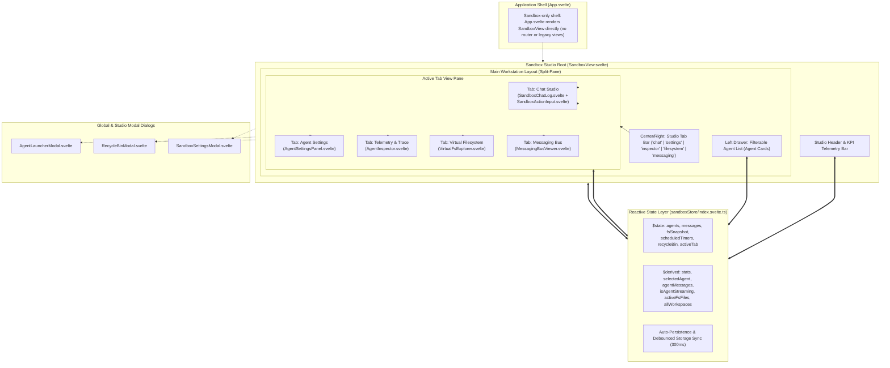
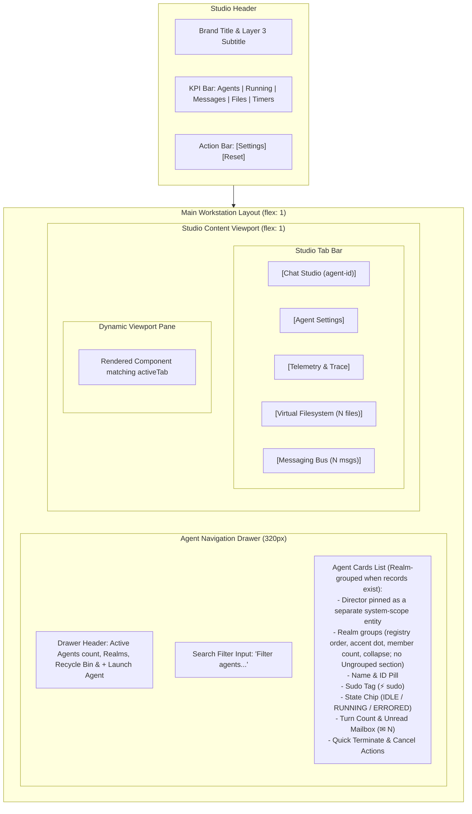
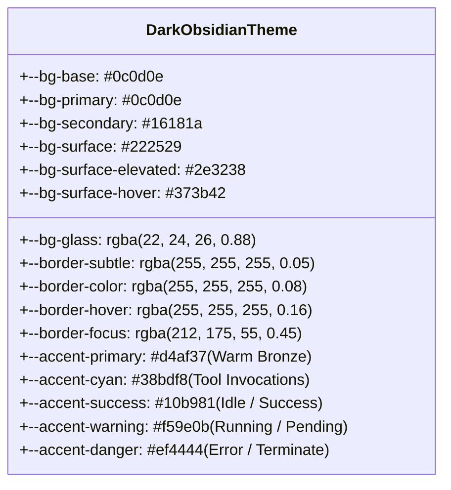

# Svelte 5 Studio Architecture & Reactive Component Hierarchy

**Status:** CANONICAL
**Last verified: 2026-09-20**

> [!NOTE]
> This document provides an exhaustive, authoritative technical specification of the **Agentic Sandbox Studio** user interface within `ai-story`. It covers the Svelte 5 runes architecture, reactive stores, split-pane workspace layout, global shortcuts, and the obsidian design token system.

---

## 1. Architectural Overview

The **Agentic Sandbox Studio** serves as the primary conversational and observability interface (Layer 3) of the `ai-story` platform. Built on **Svelte 5**, the Studio leverages the modern **Runes** reactivity system (`$state`, `$derived`, `$props`, `$effect`) to provide real-time multi-agent oversight, dynamic filesystem exploration, live cognitive trace rendering, and audit logging of inter-agent messaging.

---

## 2. Svelte 5 Runes Reactivity Paradigm

The Studio UI replaces legacy Svelte stores with **Svelte 5 Runes**, providing fine-grained reactivity and predictable state synchronization without memory leaks.

```mermaid
flowchart LR
    subgraph Svelte5Runes ["Svelte 5 Runes in Studio"]
        StateRune["$state / $state()"]
        DerivedRune["$derived / $derived.by()"]
        PropsRune["$props()"]
        EffectRune["$effect()"]
    end

    subgraph StoreLayer ["SandboxStore (sandboxStore/index.svelte.ts)"]
        S1["agents: AgentInstance[]"]
        S2["messages: Message[]"]
        S3["fsSnapshot: Record<ws, Record<path, File>>"]
        S4["scheduledTimers: Timer[]"]
        S5["recycleBin: AgentInstance[]"]
        S6["selectedAgentId: string | null"]
        S7["activeTab: string"]
        S8["agentDraftInputs: Record<id, string>"]
    end

    subgraph DerivedLayer ["Computed Telemetry & Views"]
        D1["stats (total, running, files, timers, tokens)"]
        D2["selectedAgent (AgentInstance | null)"]
        D3["agentMessages (HistoryMessage[])"]
        D4["isAgentStreaming (boolean)"]
        D5["streamingProse / streamingReasoning"]
        D6["activeFsFiles / allWorkspaces"]
    end

    subgraph DOMSync ["DOM Effects & Sync"]
        E1["Scroll Lock & Microtask Auto-Scroll"]
        E2["Per-Agent Draft Input Sync"]
        E3["Debounced Auto-Persistence (300ms)"]
    end

    StateRune --> StoreLayer
    StoreLayer --> DerivedRune
    DerivedRune --> DerivedLayer
    StoreLayer --> EffectRune
    EffectRune --> DOMSync
    PropsRune -->|Component Inputs & Callbacks| StudioRoot
```

### 2.1 `$state` Reactive Fields in `sandboxStore/index.svelte.ts`

The `$state` fields (including `agents`, `messages`, `fsSnapshot`, `scheduledTimers`, `recycleBin`, `selectedAgentId`, `activeTab`, `agentDraftInputs`, and `error`) are declared on the store class in `src/lib/sandbox/sandboxStore/index.svelte.ts`; the public surface is the generated [`sandboxStore` ICD](../generated/modules/sandboxStore.api.md).

The Studio's `activeTab` union is `'chat' | 'settings' | 'inspector' | 'filesystem' | 'messaging'` (default `'inspector'`). The demo fields (`isDemoRunning`, `demoStep`, `demoLogs`) are store-only: `runHandshakeDemo()` and the demo progress fields have no UI surface in the current Studio, so no demo banner or step-log drawer is rendered.

### 2.2 `$derived` and `$derived.by()` Telemetry & Getters

The derived getters (`stats`, `selectedAgent`, `agentMessages`, `isAgentStreaming`, `streamingProse` / `streamingReasoning`, `activeToolCalls`, `activeFsFiles`, `allWorkspaces`, `recycleBinCount`) are declared on the same store class (`src/lib/sandbox/sandboxStore/index.svelte.ts`; `$state` only — derived values are plain getters).

---

## 3. Split-Pane Workstation Architecture

The Studio workstation layout is divided into a fixed header, a left navigation drawer, and a multi-tab content viewport.

The header action bar contains **Settings** and **Reset** only. **Launch Agent** and **Recycle Bin** live in the agent drawer header (and its empty state), and **Terminate** is a per agent card action. There is no demo runner in the UI: `runHandshakeDemo()` and the demo fields are store-only.

Cross-cutting notices are not shell-wide overlays: they are rendered inside the viewport of the tab component that owns them (for example, the session recovery notice renders only while the **Telemetry & Trace** tab is active), so switching tabs unmounts them.

---

## 4. Design System & Obsidian Color Tokens

The Studio theme is defined in `src/app.css` using an **Obsidian / Charcoal Workstation Palette**, engineered for low eye fatigue during extended AI orchestration sessions.

### 4.1 CSS Design Tokens Reference Table

| Token Variable | Hex / RGBA Value | Semantic Usage |
| :--- | :--- | :--- |
| `--bg-base` | `#0c0d0e` | Darkest background; viewport canvas and root container. |
| `--bg-secondary` | `#16181a` | Secondary panels, headers, left drawer, modal containers. |
| `--bg-surface` | `#222529` | Cards, input fields, unselected tab items, tool badges. |
| `--bg-surface-elevated` | `#2e3238` | Hover states, active buttons, popovers, elevated chips. |
| `--bg-surface-hover` | `#373b42` | Interactive button hover and highlighted rows. |
| `--bg-glass` | `rgba(22, 24, 26, 0.88)` | Backdrop-filtered translucent panels (`backdrop-filter: blur(6px)`). |
| `--border-subtle` | `rgba(255, 255, 255, 0.05)` | Hairline dividers, sub-item borders, inner splits. |
| `--border-color` | `rgba(255, 255, 255, 0.08)` | Standard component borders, card perimeters, table outlines. |
| `--border-hover` | `rgba(255, 255, 255, 0.16)` | Card and button hover borders. |
| `--border-focus` | `rgba(212, 175, 55, 0.45)` | Active focus outlines for inputs and focused tabs. |
| `--text-primary` | `#f3f4f6` | High-contrast body text, primary headers, active tab labels. |
| `--text-secondary` | `#9ca3af` | Secondary descriptions, subheadings, inactive tabs. |
| `--text-muted` | `#6b7280` | Timestamps, metadata keys, character counters, disabled items. |
| `--accent-primary` | `#d4af37` | Warm bronze primary brand accent, active agent selection. |
| `--accent-cyan` | `#38bdf8` | Tool execution indicators, VirtualFS active badges. |
| `--accent-success` | `#10b981` | IDLE state chip, completed tool runs, verified API status. |
| `--accent-warning` | `#f59e0b` | RUNNING state pulse, countdown timers, unread mail badges. |
| `--accent-danger` | `#ef4444` | ERRORED state, terminate actions, delete file operations. |
| `--font-main` | `'Inter', sans-serif` | Core UI typography, buttons, labels, and forms. |
| `--font-story` | `'Lora', Georgia, serif` | Narrative prose rendering and story blockquotes. |
| `--font-mono` | `'JetBrains Mono', monospace`| Code, JSON payloads, file paths, tool arguments, IDs. |

---

## 5. Global Keyboard Shortcuts & Action Dispatch Matrix

The Studio implements contextual keyboard shortcuts across the main workspace and modals:

| Key Combination | Context / Location | Action Triggered |
| :--- | :--- | :--- |
| `Ctrl + Enter` / `Cmd + Enter` | `SandboxActionInput.svelte` | Submits conversational turn or directive to active agent. |
| `Ctrl + Enter` / `Cmd + Enter` | `SandboxMessageCard.svelte` (Editing) | Saves inline edited message draft to history. |
| `Ctrl + Enter` / `Cmd + Enter` | `AgentInspector.svelte` (Prompt area) | Executes manual turn or processes mailbox. |
| `Ctrl + Z` / `Cmd + Z` | `SandboxActionInput.svelte` (Empty input) | Undoes the last completed turn; restores prompt text. |
| `Shift + Enter` / `Ctrl + R` | `SandboxActionInput.svelte` (Interrupted) | Retries / resends an interrupted agent turn. |
| `Escape` | `AgentLauncherModal`, `RecycleBinModal`, `SandboxSettingsModal` | Dismisses active modal dialog without saving. |
| `Escape` | `SandboxMessageCard.svelte` (Editing) | Cancels inline message edit mode. |
| `Tab` / `Shift + Tab` | `AgentLauncherModal`, `RecycleBinModal` | Traps keyboard focus within the modal perimeter. |
| `Enter` | `AgentCard` (in left drawer) | Selects the agent and switches focus. |

---

## 6. Sibling Documentation Links

- [Agent Inspector Architecture](./agent_inspector.md) - Deep dive into telemetry, prompt editing, and trace monitoring.
- [VirtualFS Explorer Specifications](./virtualfs_explorer.md) - Interactive tree navigator, hex viewing, and USTAR archive utilities.
- [Chat Studio & Message Cards](./chat_and_message_cards.md) - Streaming token rendering, reasoning accordions, and diff viewers.
- [Messaging Bus Viewer](./messaging_bus_viewer.md) - Real-time pub/sub monitoring, mailbox inspectors, and event traces.
- [Modals & Dialogs Architecture](./modals_and_dialogs.md) - Comprehensive modal workflows and configuration dialogs.
