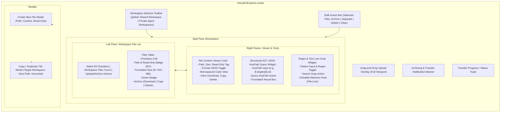
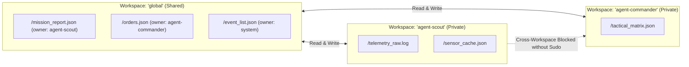
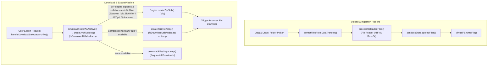
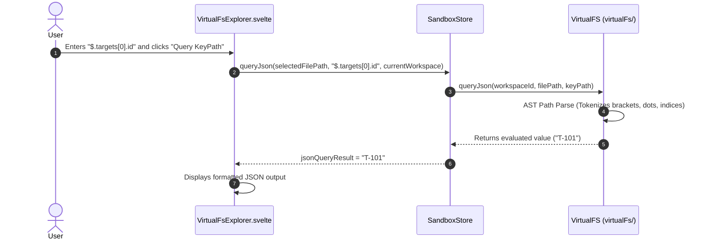

# Virtual Filesystem Explorer Architecture

**Status:** CANONICAL
**Last verified: 2026-09-20**

> [!NOTE]
> This document specifies the technical architecture, interactive file tree navigation, AST JSON keypath querying, regex line grep, USTAR archive packaging, and drag-and-drop ingestion within `VirtualFsExplorer.svelte`.

---

## 1. Architectural Overview

The **Virtual Filesystem Explorer** provides full multi-tenant workspace management, real-time file viewing, binary/JSON manipulation, structured AST querying, and archive export/import within the Studio UI.

---

## 2. Multi-Tenant Workspace Partitioning

The filesystem architecture enforces strict multi-tenant workspace isolation:

1. **`global` (Shared Workspace)**: Accessible by all agents for mission coordination, telemetry exchange, and shared status reports. Root configuration files can be marked **Read-Only** (`readOnly: true`).
2. **Private Agent Workspaces (`agent-*`)**: Sandboxed per-agent storage directories. Non-privileged agents cannot write across partitions without universal `sudo` authority.

---

## 3. Reactive State & Properties

### 3.1 Local State Variables (`$state()`)

| State Variable | Type | Default | Description |
| :--- | :--- | :--- | :--- |
| `selectedFilePath` | `string \| null` | `null` | Absolute path of the currently inspected file. |
| `isFormattedJson` | `boolean` | `true` | When true, parses and pretty-prints JSON file contents. |
| `showCreateModal` | `boolean` | `false` | Controls visibility of the New File modal. |
| `newFilePath` | `string` | `'/data.json'` | Bound path input in the New File modal. |
| `newFileContent` | `string` | `{\n  "status": "ready"\n}` | Initial content in the New File modal. |
| `newFileReadOnly` | `boolean` | `false` | Read-only flag in the New File modal (for global workspace). |
| `showCopyModal` | `boolean` | `false` | Controls visibility of the Copy File modal. |
| `copySrcFile` | `FileMeta \| null` | `null` | Source file metadata object being duplicated. |
| `copyDestPath` | `string` | `''` | Destination file path for copy operations. |
| `copyDestWorkspace` | `string` | `'global'` | Destination workspace ID for copy operations. |
| `copyOverwrite` | `boolean` | `true` | Overwrite flag for copy operations. |
| `selectedFilePaths` | `Set<string>` | `new Set()` | Set of file paths selected for multi-file bulk operations. |
| `jsonKeyPath` | `string` | `''` | Bound AST JSON query expression (e.g. `$.targets[0].id`). |
| `jsonQueryResult` | `any` | `null` | Evaluated output of the AST JSON query. |
| `jsonQueryError` | `string \| null` | `null` | Diagnostic error message from AST evaluation. |
| `grepPattern` | `string` | `''` | Search string or regex pattern for line-by-line grep. |
| `grepIsRegex` | `boolean` | `false` | Flag toggling regex evaluation vs literal substring search. |
| `grepResults` | `Array<Match> \| null` | `null` | List of matching line objects with paths and line numbers. |
| `grepError` | `string \| null` | `null` | Diagnostic error message from regex evaluation. |
| `showDownloadMenu` | `boolean` | `false` | Dropdown visibility state for workspace export actions. |
| `showUploadMenu` | `boolean` | `false` | Dropdown visibility state for file/folder import actions. |
| `isTransferring` | `boolean` | `false` | True while an upload, download, or archive packaging is in progress. |
| `isDraggingOver` | `boolean` | `false` | True when files or folders are dragged over the viewport. |
| `transferStatus` | `string \| null` | `null` | Status string displayed in the floating toast. |
| `transferError` | `Object \| null` | `null` | Error payload displayed in the notification banner. |
| `transferProgress` | `{ current, total, file }` | `{ current: 0, total: 0, file: '' }` | Real-time progress counters for bulk downloads/uploads. |
| `fileInputRef` | `HTMLElement \| null` | `null` | DOM reference to the hidden multi-file `<input type="file">` used by `handleTriggerUploadFiles()`. |
| `folderInputRef` | `HTMLElement \| null` | `null` | DOM reference to the hidden folder input (`webkitdirectory`) used by `handleTriggerUploadFolder()`. |

### 3.2 Derived State (`$derived` / `$derived.by()`)

- **`currentWorkspace`**: `$derived(sandboxStore.activeFsWorkspace)`.
- **`files`**: `$derived(sandboxStore.activeFsFiles)` (sorted alphabetically by file path).
- **`isAllSelected`**: `$derived(files.length > 0 && selectedFilePaths.size === files.length)`.
- **`selectedFile`**: Retrieves the full file object from `sandboxStore.fsSnapshot[currentWorkspace][selectedFilePath]`.

---

## 4. Archiving, Export & Ingestion Engine (`fsDownloadUtils/index.ts`)

The Studio includes an archive creation and extraction engine that handles client-side file packaging and folder uploads.

### 4.1 USTAR / `.tar.gz` Packaging Specification

When `CompressionStream('gzip')` is supported natively in modern browsers, files are packed into standard **POSIX USTAR (Uniform Standard Tape Archive)** blocks:

- **512-Byte Header Blocks**:
  - `0–99`: File name (null-padded string).
  - `100–107`: File mode (`0000644\0`).
  - `108–115`: Owner UID (`0000000\0`).
  - `116–123`: Group GID (`0000000\0`).
  - `124–135`: Octal file size in bytes (`00000000000\0`).
  - `136–147`: Modification timestamp in octal seconds.
  - `148–155`: Checksum calculated across header block with checksum field initialized to spaces.
  - `156`: Type flag (`0` for regular file).
  - `257–262`: USTAR magic string (`ustar\0`).
  - `263–264`: USTAR version (`00`).
- **Content Padding**: File data is padded with null bytes to align with 512-byte block boundaries.
- **Archive Trailer**: Terminated by two consecutive 512-byte null blocks.
- **Compression**: Piped through `new CompressionStream('gzip')` to produce standard `.tar.gz` archives.

---

## 5. Live Search & Structured Query Widgets

### 5.1 Structured AST JSON KeyPath Query Widget

Evaluates structured object paths without invoking JavaScript `eval()` or risking script injection:

- **Dot Notation**: `targets.0.id`, `sector`, `metadata.timestamp`.
- **JSONPath Syntax**: `$.targets[0].id`, `$.status`.
- **Root Query**: Empty path returns full formatted root object.

### 5.2 Regex & Line Grep Widget

Scans all text and JSON files within the active workspace partition:

- **Pattern Matching**: Evaluates substring matches or regular expressions (`new RegExp(grepPattern)`).
- **Interactive Match List**: Displays matching lines with line numbers (`/orders.json:4`). Clicking any match automatically sets `selectedFilePath` to focus the target file in the viewer.

---

## 6. Two-Way Simulation State Synchronization

Modifying specific files triggers automated synchronization with the narrative simulation runtime:

- **`/event_list.json`**:
  - `writeFile()`: Synchronously syncs into `sandboxStore.worldClock.syncFromVirtualFs(workspaceId)`.
  - `deleteFile()`: Purges in-memory event registry partition via `worldClock.clearEvents()`.
- **`/world_clock.json`**:
  - `writeFile()`: Re-indexes narrative clock time in `worldClock`.
  - `deleteFile()`: Resets simulation time to `00:00:00 Day 1` via `worldClock.resetClock()`.

---

## 7. Interaction & Action Reference Table

| Action Trigger | Component Method | Description |
| :--- | :--- | :--- |
| Click Workspace Pill | `selectWorkspace(wsId)` | Switches active workspace partition, resets selection and query states. |
| Checkbox Toggle | `toggleSelectFile(path)` | Adds or removes file path from `selectedFilePaths` set. |
| Select All Checkbox | `toggleSelectAll()` | Selects or deselects all files in the current workspace. |
| Click Download Single | `handleDownloadSingleFile(f)` | Dispatches individual file download. |
| Click Copy File | `openCopyModal(f)` | Opens Copy File modal with prefilled duplicate path (`_copy.ext`). |
| Click Delete File | `handleDeleteFile(path)` | Confirms and removes file from VirtualFS. |
| Bulk Download Archive | `handleDownloadSelectedArchive()` | Packages selected files into a `.zip` or `.tar.gz` archive via `downloadFolderAsArchive()` → `createArchiveBlob()`. |
| Bulk Download Separate | `handleDownloadSelectedSeparately()` | Downloads each selected file sequentially with progress toast. |
| Bulk Delete Files | `handleDeleteSelected()` | Batch deletes selected files from the current workspace. |
| Upload Folder | `handleTriggerUploadFolder()` | Opens folder selection dialog (`webkitdirectory`). |
| Upload Files | `handleTriggerUploadFiles()` | Opens multiple file selection dialog. |
| Drop Files / Folders | `handleDrop(e)` | Recursively extracts files from DataTransfer and writes to workspace. |

---

## 8. Sibling Documentation Links

- [Studio Architecture Overview](./studio_overview.md) - Workstation layout and Svelte 5 runes.
- [Agent Inspector Architecture](./agent_inspector.md) - Telemetry and trace monitoring.
- [Chat Studio & Message Cards](./chat_and_message_cards.md) - Conversational message stream and tool cards.
- [Messaging Bus Viewer](./messaging_bus_viewer.md) - Inter-agent message traces and mailboxes.
- [Modals & Dialogs Architecture](./modals_and_dialogs.md) - Configuration modals and action inputs.
